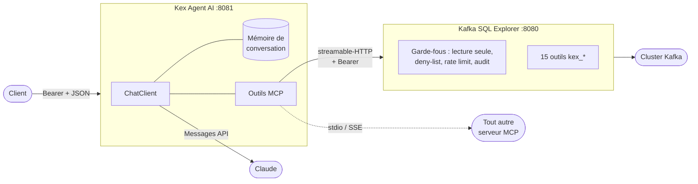

<div align="center">

# 🧭 Kex Agent AI

### Un agent IA qui se sert vraiment de vos outils — Spring Boot 4, Spring AI 2, Java 25.

[](https://github.com/devdownin/Kex-agent-ai/actions/workflows/ci.yml)
[](https://github.com/devdownin/Kex-agent-ai/actions/workflows/codeql.yml)
[](https://scorecard.dev/viewer/?uri=github.com/devdownin/Kex-agent-ai)
[](pom.xml)
[](pom.xml)
[](pom.xml)
[](docs/MCP.md)
[](LICENSE)

[Démarrage](#-démarrage) · [Ce qu'on peut lui demander](#-ce-quon-peut-lui-demander) · [Comment ça marche](#-comment-ça-marche) · [Docs](#-documentation) · [🇬🇧 English](README.md)

</div>

---

**La plupart des démos d'« agent IA » répondent de mémoire. Celui-ci va regarder.**

Kex Agent AI est un service Spring Boot qui se connecte à des serveurs [MCP](https://modelcontextprotocol.io),
découvre les outils qu'ils exposent et les présente à un modèle Claude — de sorte qu'une question
comme *« quels topics n'ont rien reçu aujourd'hui ? »* devient une vraie interrogation d'un vrai
cluster, pas une supposition bien tournée.

Il est livré branché sur [Kafka SQL Explorer](https://github.com/devdownin/Kafkaexplorer), dont le
serveur MCP expose 15 outils en lecture sur Kafka : liste des topics, SQL Flink, inférence de schéma,
traçage d'une clé à travers les topics, audits de cluster. Un `docker compose up` et vous interrogez
votre broker en langage naturel.

## ⚡ Démarrage

```bash
export ANTHROPIC_API_KEY=sk-ant-...
export EXPLORER_MCP_AUTH_TOKEN="$(openssl rand -hex 32)"
export KEX_AGENT_API_KEY="$(openssl rand -hex 32)"

docker compose up -d
```

Pas de clé Anthropic ? Branchez-le sur [OpenRouter](https://openrouter.ai) — même commande, deux
variables de plus :

```bash
export KEX_AGENT_LLM_PROVIDER=openai
export OPENROUTER_API_KEY=sk-or-v1-...
export OPENROUTER_MODEL=openai/gpt-oss-120b:free   # ou n'importe quel modèle sachant appeler des outils
```

C'est une passerelle hébergée : les prompts et les résultats d'outils — donc les messages Kafka que
l'agent lit — transitent par un tiers.
[Ce que ça implique, en détail](docs/CONFIGURATION.md#choisir-le-fournisseur-de-modele).

L'agent seul, devant un Explorer que vous faites déjà tourner :

```bash
docker run --rm -p 8081:8081 \
  -e ANTHROPIC_API_KEY=sk-ant-... -e KEX_AGENT_API_KEY=secret \
  -e KAFKA_EXPLORER_URL=http://host.docker.internal:8080 \
  compagnonsdudev/kex-agent-ai:latest
```

Trois conteneurs : un broker Kafka 4.3 (KRaft), Kafka SQL Explorer avec son serveur MCP allumé, et
cet agent branché dessus. L'Explorer sur **http://localhost:8080**, l'agent sur
**http://localhost:8081**.

```bash
curl -X POST localhost:8081/api/agent/chat \
  -H "Authorization: Bearer $KEX_AGENT_API_KEY" \
  -H 'Content-Type: application/json' \
  -d '{"message":"Liste les topics qui commencent par demo. et dis-moi lesquels sont vides."}'
```

```json
{"conversationId":"3f2b…","content":"Huit topics correspondent à demo.*. Trois sont vides : …"}
```

Ou ouvrez **http://localhost:8081** : la **Control Center**, la console que l'agent sert lui-même.
Le bearer se colle une fois ; il vit dans `sessionStorage` et ne quitte jamais le navigateur.

Pas de Docker ? [Lancez-le depuis les sources](docs/CONFIGURATION.md#lancer-depuis-les-sources) —
JDK 25 et `./mvnw spring-boot:run`.

## 🧭 La Control Center

L'agent sert sa propre console d'exploitation sur `/`, construite autour d'une seule boucle :
**observer → comprendre → décider → agir → vérifier.**

| Écran | Ce à quoi il répond |
|---|---|
| Vue d'ensemble | Est-ce que tout tourne, qu'est-ce qui demande mon attention, l'agent a-t-il décidé |
| Agent | Ce que l'agent peut et ne peut pas faire, et sous quel mode |
| Processus | État, retard et anomalies de chaque processus surveillé |
| Décisions | Chaque décision, ses observations, sa confiance, et ce qu'elle a réellement fait |
| Configuration | Seuils de détection et plancher de confiance, versionnés et audités |
| Alertes | Regroupées, actionnables, liées à un processus et à une recommandation |
| Audit | Acteur, action, motif, version de politique, résultat, identifiant de corrélation |
| Technique | Topics Kafka et retard des groupes, serveurs MCP, invocation directe, santé |
| Conversation | Le chat, en flux, avec les outils qu'il a exécutés |

Quelques partis pris explicites :

- **Un cycle d'analyse ne part que sur demande.** Pas de planificateur : en multi-instance chaque
  réplique lancerait le sien et les actions partiraient en double. En ajouter un suppose un verrou
  partagé, donc une base — une décision d'exploitation que ce projet ne prend pas à votre place.
- **Rien n'est inventé pour remplir l'écran.** Aucun processus déclaré donne un tableau de bord
  vide, et une mesure que les outils n'ont pas produite vaut `UNKNOWN`, jamais `OK`. Un état qui
  paraît sain parce que la donnée manque est exactement ce qui fait rater une panne.
- **L'autonomie se règle par capacité, et le mode ne peut que la restreindre.** Une capacité absente
  de la politique est interdite : le droit d'agir ne s'hérite pas d'une installation.
- **Chaque capacité peut exiger plus de confiance que le plancher global, jamais moins.** Redémarrer
  un consumer mérite plus de certitude que notifier. Un plancher par capacité ne peut que relever le
  plancher global : l'abaisser affaiblirait en silence la garantie que ce dernier est censé porter,
  et plus personne ne pourrait lire une politique sans vérifier chaque ligne.
- **La confiance ne s'affiche jamais seule.** Elle est toujours accompagnée des observations qui la
  fondent, parce qu'un pourcentage rendu par un modèle n'est pas une probabilité mesurée.
- **Un relevé partiel prouve une présence, jamais une absence.** Les outils MCP qui portent une
  enveloppe `coverage` disent ce qu'ils n'ont *pas* lu ; un `OK` rendu sur une passe explicitement
  incomplète devient `UNKNOWN`, là où un `WARNING` ou un `ERROR` tient — ce qui a été vu a été vu.
- **Le même symptôme deux fois est une alerte, pas deux.** Les alertes sont dédupliquées d'un cycle
  à l'autre et portent leur récurrence ; celle que le dernier cycle ne revoit plus a cessé d'être
  vraie et sort de la liste.
- **L'agent se mesure lui-même, sans inventer de chiffre.** Son taux de pertinence ne compte que les
  recommandations qu'un humain a tranchées — une exécution autonome ne se confirme pas elle-même —
  et reste absent tant que personne n'a tranché, là où un `0` se lirait « toujours faux ».
- **La couleur ne porte jamais un état à elle seule.** Chaque état vient avec un glyphe et un libellé.
- **Une action sensible se confirme avec ce qu'elle va faire** — *Confirmer : Redémarrer Consumer
  Integration-02*, pas *Êtes-vous sûr ?*

## 💬 Ce qu'on peut lui demander

Avec Kafka SQL Explorer branché, le modèle a de vrais verbes au lieu d'un vague souvenir :

| Vous demandez | L'agent appelle | Vous obtenez |
|---|---|---|
| *« Qu'y a-t-il dans demo.orders ? »* | `kex_preview_messages`, `kex_infer_schema` | De vrais enregistrements, et la structure déduite |
| *« Où est passée la commande ORD-1042 ? »* | `kex_trace_key` | Son parcours entre topics, hop par hop, avec la latence |
| *« Pourquoi la DLQ se remplit ? »* | `kex_run_audit`, `kex_get_audit` | Un diagnostic gradué, pas un dump de métadonnées |
| *« Quels groupes sont en retard ? »* | `kex_consumer_lag` | Le retard en temps : l'âge du plus vieux message non lu |
| *« Compte les commandes d'hier > 100 € »* | `kex_sql_query` | Le SQL Flink exécuté, et les lignes obtenues |

Le modèle choisit l'outil ; le serveur applique les garde-fous. L'Explorer est en lecture seule par
défaut, avec deny-list, rate limit et journal d'audit — **l'agent en hérite, il ne les remplace pas.**

## 🧩 Comment ça marche



Une requête, de bout en bout :

1. Le client poste un message avec son bearer. Tout `/api/**` est authentifié — l'agent dépense de
   l'argent et exécute des outils, il est donc fermé par défaut.
2. Le `ChatClient` rejoue la fenêtre de conversation puis interroge Claude avec **tous les outils MCP
   attachés**. La liste est relue à chaque requête : un serveur qui publie un nouvel outil est pris
   en compte sans redémarrage.
3. Claude répond, ou demande un outil. Spring AI exécute l'appel via MCP, renvoie le résultat et
   boucle — plafonné à 20 appels par échange, pour qu'un modèle égaré ne fasse pas grimper la note.
4. La réponse revient, et l'échange est ajouté à la mémoire de cette conversation.

**Les détails qui comptent sont les ennuyeux**, et ils sont écrits : pourquoi les clients MCP sont
initialisés paresseusement, pourquoi les serveurs sont adressés par clé de connexion, pourquoi
l'endpoint d'appel direct est une arme chargée. Voir [`docs/ARCHITECTURE.md`](docs/ARCHITECTURE.md).

## 🔌 Brancher votre propre serveur MCP

Trois transports, aucun code :

```yaml
spring:
  ai:
    mcp:
      client:
        stdio:                       # un processus local
          connections:
            filesystem:
              command: npx
              args: ["-y", "@modelcontextprotocol/server-filesystem", "/data"]
        streamable-http:             # un serveur distant
          connections:
            mes-outils:
              url: https://mcp.interne.example.com
              endpoint: /mcp

kex:
  mcp:
    bearer-tokens:                   # s'il demande une authentification
      - url-prefix: https://mcp.interne.example.com
        token: ${MON_JETON_MCP}
```

Redémarrez, puis `GET /api/agent/mcp/servers` vous dit ce qui a été trouvé. L'histoire complète —
y compris ce qu'est MCP si c'est votre premier — est dans [`docs/MCP.md`](docs/MCP.md).

## 🔭 API

| Méthode | Route | Rôle |
|---|---|---|
| `POST` | `/api/agent/chat` | Poser une question, obtenir la réponse, le `conversationId`, les outils utilisés, les jetons consommés et le motif d'arrêt |
| `POST` | `/api/agent/chat/structured` | Idem, réponse en JSON conforme à un schéma que vous fournissez |
| `POST` | `/api/agent/chat/stream` | Idem, en événements SSE nommés : `conversation`, `token`, `tool`, `error` |
| `DELETE` | `/api/agent/conversations/{id}` | Oublier une conversation |
| `GET` | `/api/agent/mcp/servers` | Quels serveurs MCP sont connectés, et ce qu'ils exposent |
| `POST` | `/api/agent/mcp/servers/{connection}/tools/{tool}` | Appeler un outil directement, sans modèle |
| `GET` | `/api/agent/mcp/servers/{connection}/resources` | Lister les ressources d'un serveur |
| `GET` | `/api/agent/mcp/servers/{connection}/resource?uri=…` | En lire une |
| `POST` `GET` `DELETE` | `/api/agent/knowledge` | Alimenter, chercher et élaguer la base de connaissance (si activée) |
| `GET` | `/api/agent/supervision/overview` | Tout ce qu'il faut au premier écran, en une requête |
| `POST` | `/api/agent/supervision/cycles` | Lancer un cycle d'analyse maintenant |
| `GET` | `/api/agent/supervision/decisions` | Chaque décision, ses observations et son résultat |
| `POST` | `/api/agent/supervision/decisions/{id}/approve` `…/reject` | Valider ou refuser une action en attente |
| `GET` `PUT` | `/api/agent/supervision/policy` | Mode, autonomie et plancher de confiance par capacité, seuils — versionnés |
| `POST` | `/api/agent/supervision/pause` `…/resume` | Suspendre et reprendre les analyses |
| `GET` | `/api/agent/kafka/topics` | Topics, avec les mesures absentes rendues absentes, jamais à zéro |
| `GET` | `/api/agent/kafka/topics/{topic}/lag` | Les groupes qui lisent un topic, avec le verdict de retard de l'outil |
| `GET` | `/api/agent/supervision/alerts` | Dédupliquées, priorisées, portant chacune son action en attente |
| `GET` | `/api/agent/supervision/performance` | Ce que vaut l'agent lui-même — pertinence, autonomie, délais |
| `GET` | `/api/agent/supervision/audit` | Qui a fait quoi, pourquoi, sous quelle politique, avec quel résultat |

La description OpenAPI est servie sur `/v3/api-docs`, Swagger UI sur `/swagger-ui.html`, et la
Control Center sur `/`. Les trois sont ouverts en `GET` : la *forme* de l'API est déjà publique dans
ce dépôt, et la console est du HTML inerte qui ne porte aucun secret — les cacher ne ferait que les
rendre inutilisables dans un navigateur. Ce qui est protégé, c'est tout ce qui agit ou coûte.

Toute route sous `/api/**` exige `Authorization: Bearer $KEX_AGENT_API_KEY`. `/actuator/health`
reste ouvert pour les sondes de conteneur.

Le flux émet un événement `tool` à chaque outil terminé — nom, durée, échec ou non — pour que la
connexion ne reste jamais muette pendant la minute que peut prendre un outil, et qu'une interface
puisse montrer ce que l'agent fait. La route bloquante rend la même liste dans son champ `tools`.
Le flux s'ouvre sur un événement `conversation` portant l'identifiant — un client qui n'en a pas
fourni peut ainsi enchaîner et purger — et un échec arrive en événement `error` plutôt qu'en socket
qui s'arrête, ce qu'un client ne distingue pas d'une réponse terminée. Chaque échange est plafonné
à `kex.agent.request-timeout` (120s par défaut), tours d'outils compris ; au-delà, la route
bloquante répond `504`.

## 🔐 Posture de sécurité

- **Fermé par défaut.** Pas de `kex.agent.api-key` configurée → `/api/**` répond `503`, pas `200`.
  Un agent qui dépense des jetons et exécute des outils ne se livre pas ouvert.
- **Boucle locale par défaut.** Compose lie tous les ports à `127.0.0.1` ; `BIND_ADDR=0.0.0.0` est
  une décision qu'on prend, pas une qu'on subit.
- **Les jetons restent chez eux.** Le bearer MCP n'est injecté que sur les requêtes correspondant au
  préfixe d'URL déclaré : le secret d'un serveur ne part jamais vers un autre.
- **L'endpoint d'appel direct n'a pas de modèle dans la boucle.** L'autorisation est entièrement à la
  charge de l'appelant. Lire
  [`docs/ARCHITECTURE.md`](docs/ARCHITECTURE.md#the-direct-tool-endpoint) avant de l'exposer.

## 📚 Documentation

| Document | Contenu |
|---|---|
| [`docs/ARCHITECTURE.md`](docs/ARCHITECTURE.md) | Composants, cycle d'une requête, et les décisions avec leur raison |
| [`docs/MCP.md`](docs/MCP.md) | Ce qu'est MCP, les trois transports, brancher un serveur, écrire le sien |
| [`docs/CONFIGURATION.md`](docs/CONFIGURATION.md) | Toutes les propriétés, les profils, lancer depuis les sources |
| [`docs/OBSERVABILITE.md`](docs/OBSERVABILITE.md) | Métriques de coût et d'outils, scraping, seuils d'alerte |
| [`docs/CONNAISSANCE.md`](docs/CONNAISSANCE.md) | La base de connaissance : pourquoi éteinte, comment l'allumer, l'alimenter et la diagnostiquer |

## 🧪 Tests

```bash
./mvnw verify
```

78 tests, sans réseau ni secret. Dont un test d'intégration MCP qui monte un **vrai** serveur
streamable-HTTP derrière un bearer et fait passer le client réel par le handshake, `tools/list`,
`tools/call`, `resources/list` et `resources/read` — le transport est exercé, pas simulé.

La CI construit en plus l'image Docker et la teste — le conteneur doit démarrer **sans aucun serveur
MCP joignable**, refuser un appel non authentifié, et servir un appel authentifié — puis monte une
vraie stack compose (`compose/smoke.yml` : l'agent et un serveur MCP factice) et vérifie que l'agent
découvre le serveur, son outil, et l'appelle à travers le réseau avec le bearer partagé.

## 🗺️ Stack

| Composant | Version |
|---|---|
| Java | 25 |
| Spring Boot | 4.1.1 |
| Spring AI | 2.0.1 |
| Modèle | Anthropic, ou n'importe quel modèle d'OpenRouter — à une variable près |
| MCP | `spring-ai-starter-mcp-client` — stdio, SSE, streamable-HTTP |

## 📖 Lui donner ce que votre équipe sait

Les outils MCP disent ce qui **est** dans le cluster. Ils ne disent pas ce que votre équipe **sait** :
la convention de nommage des topics, le runbook d'une DLQ qui se remplit, pourquoi `demo.orders`
garde 7 jours. Activez la base de connaissance et chaque question y est cherchée d'abord, les
passages pertinents étant ajoutés au prompt.

```bash
curl -X POST localhost:8081/api/agent/knowledge \
  -H "Authorization: Bearer $KEX_AGENT_API_KEY" -H 'Content-Type: application/json' \
  -d '[{"text":"demo.orders garde 7 jours — exigence d audit, ticket OPS-412.",
        "metadata":{"source":"runbook"}}]'
```

Elle est livrée **éteinte** : la recherche exige un modèle d'embeddings, une infrastructure que
l'agent n'impose pas pour démarrer. [`docs/CONNAISSANCE.md`](docs/CONNAISSANCE.md) donne les trois
façons d'en fournir un, et la route `GET` qui exécute exactement la recherche que le modèle voit —
une réponse décevante se diagnostique donc contre la base, elle ne se devine pas.

## 🛡️ Chaîne d'approvisionnement

Chaque image de release est construite depuis un commit tagué, publiée multi-arch sur GHCR avec
provenance et SBOM. Le build émet lui-même un SBOM CycloneDX (`target/classes/META-INF/sbom/`), la
CI impose les en-têtes de licence, le format et un plancher de couverture, CodeQL tourne par pull
request et chaque semaine, OpenSSF Scorecard chaque semaine, et Dependabot surveille Maven, Actions
et Docker. Chaque GitHub Action est épinglée par SHA de commit.

## 🤝 Contribuer

[`CONTRIBUTING.md`](CONTRIBUTING.md) pour la marche à suivre et les règles de la maison,
[`SECURITY.md`](SECURITY.md) pour signaler une faille — en privé, jamais en issue.

## 📄 Licence

GPL-3.0 — voir [LICENSE](LICENSE).
