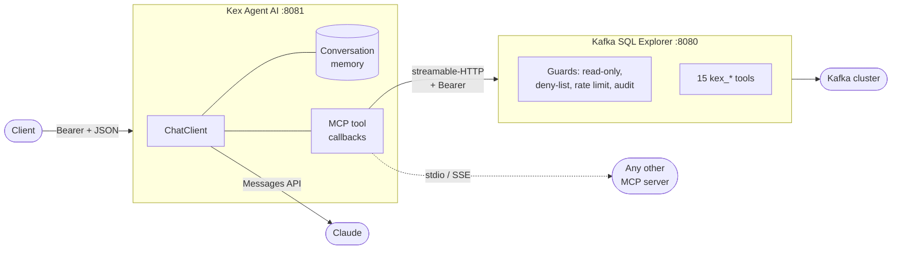

<div align="center">

# 🧭 Kex Agent AI

### An AI agent that actually uses your tools — Spring Boot 4, Spring AI 2, Java 25.

[](https://github.com/devdownin/Kex-agent-ai/actions/workflows/ci.yml)
[](https://github.com/devdownin/Kex-agent-ai/actions/workflows/codeql.yml)
[](https://scorecard.dev/viewer/?uri=github.com/devdownin/Kex-agent-ai)
[](pom.xml)
[](pom.xml)
[](pom.xml)
[](docs/MCP.md)
[](LICENSE)

[Quick start](#-quick-start) · [What you can ask it](#-what-you-can-ask-it) · [How it works](#-how-it-works) · [Docs](#-documentation) · [🇫🇷 Français](README.fr.md)

</div>

---

**Most "AI agent" demos answer from the model's memory. This one goes and looks.**

Kex Agent AI is a Spring Boot service that connects to [MCP](https://modelcontextprotocol.io) servers,
discovers the tools they expose, and hands them to a Claude model — so a question like *"which topics
received nothing today?"* becomes a real query against a real cluster, not a plausible-sounding guess.

It ships wired to [Kafka SQL Explorer](https://github.com/devdownin/Kafkaexplorer), whose MCP server
exposes 15 read-only tools over Kafka: topic listing, Flink SQL, schema inference, cross-topic key
tracing, cluster audits. One `docker compose up` and you are asking questions of your broker in
plain language.

## ⚡ Quick start

```bash
export ANTHROPIC_API_KEY=sk-ant-...
export EXPLORER_MCP_AUTH_TOKEN="$(openssl rand -hex 32)"
export KEX_AGENT_API_KEY="$(openssl rand -hex 32)"

docker compose up -d
```

No Anthropic key? Point it at [OpenRouter](https://openrouter.ai) instead — same command, two
variables swapped:

```bash
export KEX_AGENT_LLM_PROVIDER=openai
export OPENROUTER_API_KEY=sk-or-v1-...
export OPENROUTER_MODEL=openai/gpt-oss-120b:free   # or any tool-calling model on the gateway
```

It is a hosted gateway, so prompts and tool results — including the Kafka records the agent reads —
travel through a third party. [The trade-offs, in full](docs/CONFIGURATION.md#choisir-le-fournisseur-de-modele).

Just the agent, against an Explorer you already run:

```bash
docker run --rm -p 8081:8081 \
  -e ANTHROPIC_API_KEY=sk-ant-... -e KEX_AGENT_API_KEY=secret \
  -e KAFKA_EXPLORER_URL=http://host.docker.internal:8080 \
  compagnonsdudev/kex-agent-ai:latest
```

Three containers: a Kafka 4.3 broker (KRaft), Kafka SQL Explorer with its MCP server switched on,
and this agent wired to it. Explorer lands on **http://localhost:8080**, the agent on
**http://localhost:8081**.

```bash
curl -X POST localhost:8081/api/agent/chat \
  -H "Authorization: Bearer $KEX_AGENT_API_KEY" \
  -H 'Content-Type: application/json' \
  -d '{"message":"List the topics whose name starts with demo. and tell me which ones are empty."}'
```

```json
{"conversationId":"3f2b…","content":"Eight topics match demo.*. Three are empty: demo.returns, …"}
```

Or open **http://localhost:8081** for the **Control Center** — the console the agent serves itself.
Paste the same bearer once; it lives in `sessionStorage` and never leaves the browser.

No Docker? [Run it from source](docs/CONFIGURATION.md#running-from-source) — JDK 25 and `./mvnw spring-boot:run`.

## 🧭 The Control Center

The agent ships with its own operations console at `/`, built around one loop:
**observe → understand → decide → act → verify.**

| Screen | What it answers |
|---|---|
| Overview | Is everything running, what needs me, has the agent decided anything |
| Agent | What the agent may and may not do, and under which mode |
| Processes | Per-process state, delay, and the anomalies found on each |
| Decisions | Every decision, its observations, its confidence, and what it actually did |
| Configuration | Detection thresholds and confidence floor, versioned and audited |
| Alerts | Grouped, actionable, each tied to a process and a recommendation |
| Audit | Actor, action, reason, policy version, result, correlation id |
| Technical | Kafka topics and consumer-group lag, MCP servers, direct tool invocation, health |
| Conversation | The chat, streamed, with the tools it ran |

A few things it deliberately does:

- **An analysis cycle runs on request by default, and off a schedule only where it can be locked.**
  A bare scheduler would have every replica launch its own cycle in multi-instance, firing every
  action twice. `kex.agent.supervision.schedule.enabled` turns on an unattended cycle behind a
  shared lock, but only under the `shared-memory` profile — the only place that lock can live.
- **Nothing is invented to fill the screen.** No process declared means an empty dashboard, and a
  measurement the tools could not produce is `UNKNOWN`, never `OK`. A state that looks healthy
  because the data is missing is exactly what makes an outage go unnoticed.
- **Autonomy is set per capability, and the mode can only narrow it.** A capability not named in
  the policy is forbidden — the right to act is not inherited from an install.
- **Each capability can demand more confidence than the global floor, never less.** Restarting a
  consumer deserves more certainty than sending a notification. A per-capability floor can only
  raise the global one: letting it lower the floor would quietly weaken the guarantee the global
  setting is there to carry, and nobody could read a policy without checking every line.
- **Confidence never travels alone.** It is always shown next to the observations it rests on,
  because a percentage produced by a model is not a measured probability.
- **A partial read proves presence, never absence.** MCP tools that carry a `coverage` envelope
  say what they did *not* read; an `OK` returned on an explicitly incomplete pass becomes `UNKNOWN`,
  while a `WARNING` or `ERROR` stands — what was seen was seen.
- **The same symptom twice is one alert, not two.** Alerts are deduplicated across cycles and carry
  how often they recurred; one the latest cycle no longer sees has stopped being true and leaves.
- **The agent measures itself, without inventing figures.** Its relevance rate counts only the
  recommendations a human ruled on — an autonomous run never confirms itself — and stays absent
  until someone has ruled, where a `0` would read as "always wrong".
- **Colour never carries a state by itself.** Every state ships a glyph and a label too.
- **Sensitive actions confirm with what they will do** — *Confirm: restart Consumer Integration-02*,
  not *Are you sure?*

## 💬 What you can ask it

With Kafka SQL Explorer connected, the model has real verbs instead of vague recall:

| You ask | The agent calls | You get |
|---|---|---|
| *"What's in demo.orders?"* | `kex_preview_messages`, `kex_infer_schema` | Real records, plus the structure inferred from them |
| *"Where did order ORD-1042 go?"* | `kex_trace_key` | Its path across topics, hop by hop, with latency |
| *"Why is the DLQ filling up?"* | `kex_run_audit`, `kex_get_audit` | A graded diagnosis, not a metadata dump |
| *"Which consumer groups are behind?"* | `kex_consumer_lag` | Time lag — the age of the oldest unread message |
| *"Count yesterday's orders over 100 €"* | `kex_sql_query` | The Flink SQL it ran, and the rows it got back |

The model picks the tool; the server enforces the guardrails. Explorer is read-only by default, with
a deny-list, rate limiting and an audit trail — **the agent inherits those, it does not replace them.**

## 🧩 How it works



One request, end to end:

1. The client posts a message with its bearer token. Anything under `/api/**` is authenticated —
   the agent spends money and executes tools, so it is closed by default.
2. The `ChatClient` replays the conversation window, then asks Claude with **every MCP tool attached**.
   The tool list is re-read from the MCP clients on each request, so a server that publishes a new
   tool is picked up without a restart.
3. Claude answers, or asks for a tool. Spring AI runs the call over MCP, feeds the result back, and
   loops — capped at 20 tool calls per exchange so a confused model cannot run up a bill.
4. The answer comes back, and the exchange is appended to that conversation's memory.

**The details that matter are the boring ones**, and they are written down: why MCP clients are
initialized lazily, why servers are addressed by connection key, why the tool-call endpoint is a
loaded gun. See [`docs/ARCHITECTURE.md`](docs/ARCHITECTURE.md).

## 🔌 Plug in your own MCP server

Three transports, no code:

```yaml
spring:
  ai:
    mcp:
      client:
        stdio:                       # a local process
          connections:
            filesystem:
              command: npx
              args: ["-y", "@modelcontextprotocol/server-filesystem", "/data"]
        streamable-http:             # a remote server
          connections:
            my-tools:
              url: https://mcp.internal.example.com
              endpoint: /mcp

kex:
  mcp:
    bearer-tokens:                   # if it needs authentication
      - url-prefix: https://mcp.internal.example.com
        token: ${MY_MCP_TOKEN}
```

Restart, then `GET /api/agent/mcp/servers` tells you what it found. The whole story — including what
MCP is, if this is your first one — is in [`docs/MCP.md`](docs/MCP.md).

You can also manage them under **Technical → MCP servers**: test before add, HTTP or stdio,
per-tool permissions, diagnostics, enable/disable and import/export. Set `KEX_MCP_STORAGE_KEY` to
encrypt and retain these connections; for stdio, explicitly allow executables with
`KEX_MCP_STDIO_ALLOWED_COMMANDS=npx,uvx`.

## 🔭 API

| Method | Route | What it does |
|---|---|---|
| `POST` | `/api/agent/chat` | Ask a question, get an answer, the `conversationId`, the tools it used, the tokens it cost and why the model stopped |
| `POST` | `/api/agent/chat/structured` | Same, answered as JSON matching a schema you supply |
| `POST` | `/api/agent/chat/stream` | Same, streamed as named SSE events: `conversation`, `token`, `tool`, `error` |
| `DELETE` | `/api/agent/conversations/{id}` | Forget a conversation |
| `GET` | `/api/agent/mcp/servers` | Which MCP servers are connected, and what they expose |
| `POST` | `/api/agent/mcp/servers/{connection}/tools/{tool}` | Call a tool directly, no model involved |
| `GET` | `/api/agent/mcp/servers/{connection}/resources` | List a server's resources |
| `GET` | `/api/agent/mcp/servers/{connection}/resource?uri=…` | Read one |
| `POST` `GET` `DELETE` | `/api/agent/knowledge` | Feed, search and prune the knowledge base (when enabled) |
| `GET` | `/api/agent/supervision/overview` | Everything the first screen needs, in one request |
| `POST` | `/api/agent/supervision/cycles` | Run an analysis cycle now |
| `GET` | `/api/agent/supervision/decisions` | Every decision, with its observations and outcome |
| `POST` | `/api/agent/supervision/decisions/{id}/approve` `…/reject` | Human-in-the-loop on a pending action |
| `GET` `PUT` | `/api/agent/supervision/policy` | Mode, per-capability autonomy and confidence floors, thresholds — versioned |
| `POST` | `/api/agent/supervision/pause` `…/resume` | Stop and restart analysis |
| `GET` | `/api/agent/kafka/topics` | Topics, with unmeasured values shown as unmeasured, never as zero |
| `GET` | `/api/agent/kafka/topics/{topic}/lag` | The groups reading a topic, with the tool's own lag verdict |
| `GET` | `/api/agent/supervision/alerts` | Deduplicated, prioritized, each carrying its pending action |
| `GET` | `/api/agent/supervision/performance` | How the agent itself is doing — relevance, autonomy, delays |
| `GET` | `/api/agent/supervision/audit` | Who did what, why, under which policy, with what result |

The OpenAPI description is served at `/v3/api-docs`, with Swagger UI at `/swagger-ui.html`, and the
Control Center at `/`. All three are open on `GET`: the *shape* of the API is already public in this
repository, and the console is inert HTML that holds no secret — hiding either would only make them
unusable in a browser. What is protected is everything that acts or costs money.

Every route under `/api/**` requires `Authorization: Bearer $KEX_AGENT_API_KEY`. `/actuator/health`
stays open for container probes.

The stream emits a `tool` event each time one finishes — name, duration, whether it failed — so the
connection is never silent for the minute a tool may take, and a UI can show what the agent is doing.
The blocking route returns the same list in its `tools` field. The stream opens with a `conversation`
event carrying the id — a client that did not supply one can
still follow up and clean up — and a failure arrives as an `error` event rather than a socket that
simply stops, which a client cannot tell apart from a finished answer. Exchanges are capped at
`kex.agent.request-timeout` (120s by default), tool rounds included; the blocking route answers
`504` past it.

## 🔐 Security posture

- **Closed by default.** No `kex.agent.api-key` configured → `/api/**` answers `503`, not `200`.
  An agent that spends tokens and executes tools does not ship open.
- **Loopback by default.** Compose binds every port to `127.0.0.1`; `BIND_ADDR=0.0.0.0` is a decision
  you make, not one you inherit.
- **Tokens stay where they belong.** The MCP bearer is injected only on requests matching the
  declared URL prefix, so one server's credential never reaches another.
- **The direct tool endpoint has no model in the loop.** Authorization is entirely on the caller.
  Read [`docs/ARCHITECTURE.md#the-direct-tool-endpoint`](docs/ARCHITECTURE.md#the-direct-tool-endpoint)
  before exposing it.

## 📚 Documentation

| Document | What's in it |
|---|---|
| [`docs/ARCHITECTURE.md`](docs/ARCHITECTURE.md) | Components, request lifecycle, and the design decisions with their reasons |
| [`docs/MCP.md`](docs/MCP.md) | What MCP is, the three transports, connecting a server, writing your own |
| [`docs/CONFIGURATION.md`](docs/CONFIGURATION.md) | Every property and environment variable, the profiles, running from source |
| [`docs/OBSERVABILITE.md`](docs/OBSERVABILITE.md) | Cost and tool metrics, scraping them, what to alert on |
| [`docs/CONNAISSANCE.md`](docs/CONNAISSANCE.md) | The knowledge base: why it is off, how to turn it on, how to feed and debug it |

## 🧪 Tests

```bash
./mvnw verify
```

78 tests, no network, no secrets. Including an MCP integration test that stands up a **real**
streamable-HTTP server behind a bearer token and drives the actual client through handshake,
`tools/list`, `tools/call`, `resources/list` and `resources/read` — the transport is exercised, not
mocked.

CI additionally builds the Docker image and smoke-tests it — the container must start with **no MCP
server reachable at all**, refuse an unauthenticated call, and serve an authenticated one — then
brings a real compose stack up (`compose/smoke.yml`: the agent plus a stub MCP server) and checks
the agent discovers the stub, its tool, and calls it through the network with the shared bearer.

## 🗺️ Stack

| Component | Version |
|---|---|
| Java | 25 |
| Spring Boot | 4.1.1 |
| Spring AI | 2.0.1 |
| Model | Anthropic, or any OpenRouter model — one variable apart |
| MCP | `spring-ai-starter-mcp-client` — stdio, SSE, streamable-HTTP |

## 📖 Give it what your team knows

MCP tools say what **is** in the cluster. They do not say what your team **knows**: the topic naming
convention, the runbook for a filling DLQ, why `demo.orders` keeps 7 days. Turn the knowledge base
on and every question is searched against it first, with the relevant passages added to the prompt.

```bash
curl -X POST localhost:8081/api/agent/knowledge \
  -H "Authorization: Bearer $KEX_AGENT_API_KEY" -H 'Content-Type: application/json' \
  -d '[{"text":"demo.orders keeps 7 days — audit requirement, see ticket OPS-412.",
        "metadata":{"source":"runbook"}}]'
```

It ships **off**: retrieval needs an embedding model, which is infrastructure the agent does not
impose to start. [`docs/CONNAISSANCE.md`](docs/CONNAISSANCE.md) has the three ways to provide one,
and the `GET` route that runs the exact same search the model sees — so a disappointing answer is
diagnosed against the base, not guessed at.

## 🛡️ Supply chain

Every release image is built from a tagged commit, published multi-arch to GHCR with provenance and
an SBOM. The build itself emits a CycloneDX SBOM (`target/classes/META-INF/sbom/`), CI enforces the
license headers, the format, and a coverage floor, CodeQL runs per pull request and weekly, OpenSSF
Scorecard weekly, and Dependabot watches Maven, Actions and Docker. Every GitHub Action is pinned by
commit SHA.

## 🤝 Contributing

[`CONTRIBUTING.md`](CONTRIBUTING.md) for the workflow and the house rules, [`SECURITY.md`](SECURITY.md)
for reporting a vulnerability — privately, never as an issue.

## 📄 License

GPL-3.0 — see [LICENSE](LICENSE).
