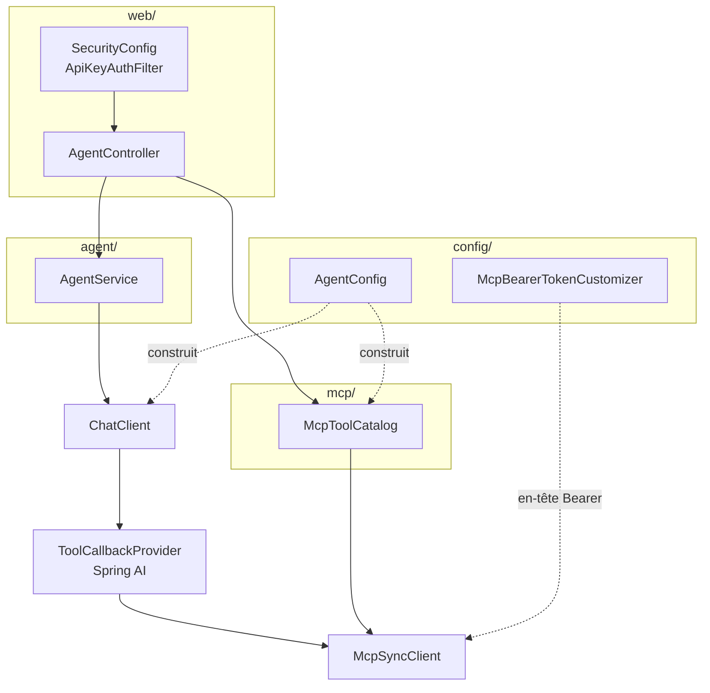
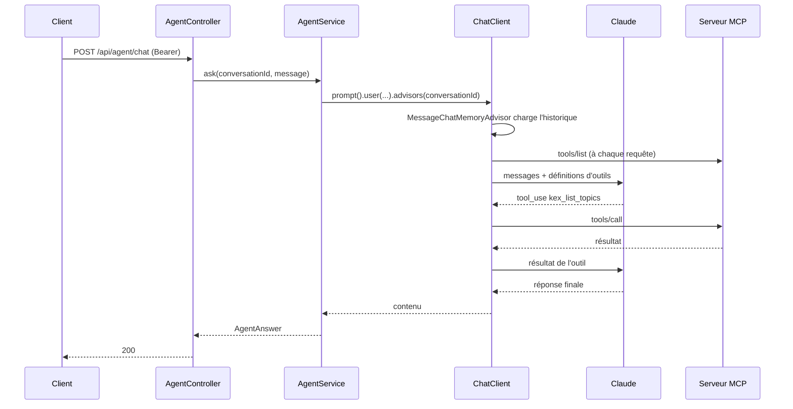

# Architecture

Ce document explique **comment l'agent est construit et pourquoi**. Les décisions y sont données
avec la raison qui les a produites — souvent un comportement observé, pas une préférence.

## Les pièces



| Classe | Rôle |
|---|---|
| `AgentController` | Les 7 routes REST et la traduction des erreurs MCP en codes HTTP |
| `AgentService` | Conversation : identifiant, mémoire, appel bloquant ou flux |
| `McpToolCatalog` | Introspection et invocation directe des serveurs MCP |
| `AgentConfig` | Construit le `ChatClient`, la mémoire, le catalogue |
| `McpBearerTokenCustomizer` | Injecte `Authorization: Bearer` sur les transports MCP HTTP |
| `SecurityConfig` + `ApiKeyAuthFilter` | Bearer statique sur `/api/**` |

## Le cycle d'une requête



La boucle outil ↔ modèle est tenue par Spring AI, pas par ce code. Ce qui est à nous : le choix des
outils exposés, la mémoire, les plafonds, et la traduction des erreurs.

## Décisions

### Initialisation paresseuse des clients MCP

`spring.ai.mcp.client.initialized: false`.

En initialisation hâtive (le défaut), l'autoconfiguration appelle `initialize()` sur chaque client
pendant le refresh du contexte. Constaté en démarrant le JAR avec l'Explorer éteint :

```
Failed to instantiate [java.util.List]: Factory method 'mcpSyncClients' threw exception
with message: Client failed to initialize by explicit API call
```

L'agent ne démarrait pas parce qu'un service tiers était éteint. En paresseux, il démarre, et
`McpToolCatalog` retente l'initialisation à chaque accès — un serveur qui arrive en retard est
rattrapé sans redémarrage. C'est aussi ce qui permet au service `agent` de docker compose de ne pas
attendre la sonde de santé de l'Explorer.

### Les serveurs sont adressés par clé de connexion

`/api/agent/mcp/servers/{connection}/...` prend la clé de configuration
(`…connections.<clé>`), pas le nom que le serveur annonce.

La raison est directe : le nom annoncé n'existe qu'après le handshake. Avec l'initialisation
paresseuse, adresser par nom annoncé rendrait un serveur non initialisé **inadressable**, donc
impossible à réveiller. La clé de connexion, elle, est connue dès le démarrage.

`GET /api/agent/mcp/servers` renvoie les deux : `connection` (la clé, celle qui adresse) et
`serverName` (ce que le serveur dit être, `null` tant qu'il n'a pas répondu).

### Le bearer MCP est filtré par préfixe d'URL

Le transport streamable-HTTP de Spring AI n'a pas de propriété d'en-tête. Le point d'extension est
`McpSyncHttpClientRequestCustomizer` — mais un tel bean s'applique à **toutes** les connexions HTTP
MCP. Tel quel, le jeton de l'Explorer partirait aussi vers n'importe quel autre serveur MCP
configuré.

D'où `kex.mcp.bearer-tokens[]`, une liste de couples `url-prefix` / `token` : le customizer ne pose
l'en-tête que sur les requêtes dont l'URI commence par le préfixe déclaré.

### Plafond de la boucle d'outils

```yaml
spring.ai.tools.limits.max-total-tool-calls: 20
spring.ai.tools.limits.on-limit-exceeded: return_error_response
```

Sans plafond, un modèle qui s'entête sur un outil tourne jusqu'au timeout HTTP, à vos frais.
`RETURN_ERROR_RESPONSE` plutôt que `THROW` : le modèle reçoit l'erreur et conclut, là où l'exception
rendrait une 500 sans réponse à l'appelant.

### Mémoire : en mémoire par défaut, partagée sur demande

`MessageWindowChatMemory` sur `InMemoryChatMemoryRepository`. Deux instances derrière un load
balancer ne verraient pas les mêmes conversations.

Le profil `shared-memory` bascule sur PostgreSQL. Il ne pouvait pas être le défaut : le simple fait
d'avoir le starter JDBC sur le classpath fait échouer le démarrage sans base
(`Failed to determine a suitable driver class`). Les autoconfigurations JDBC sont donc exclues dans
`application.yml`, et le profil **annule** cette liste — une liste de propriétés n'est pas fusionnée
entre sources, la source la plus prioritaire gagne en entier.

### Le flux SSE porte son identité et ses erreurs

`POST /chat/stream` rendait un flux de texte nu. Deux défauts qui n'en sont pas moins réels pour
être discrets :

- l'identifiant de conversation généré quand le client n'en fournit pas n'était **jamais rendu** :
  la conversation était écrite en mémoire sous une clé que personne ne connaissait, donc impossible
  à poursuivre et impossible à purger par `DELETE /conversations/{id}` ;
- une erreur en cours de flux fermait la connexion sans un mot, et une réponse tronquée est
  indiscernable d'une réponse complète côté client.

Le flux émet donc des événements nommés : `conversation` (l'identifiant, en premier), `token`, et
`error` en cas d'échec. Le détail de l'exception reste dans les journaux ; l'appelant reçoit un
message court.

### Plafond de durée d'un échange

`kex.agent.request-timeout`, 120s par défaut. `spring.ai.mcp.client.request-timeout` borne *chaque*
appel MCP, pas l'échange : avec vingt tours d'outils autorisés, le pire cas gardait une connexion
HTTP ouverte une vingtaine de minutes.

Les deux chemins ne sont pas équivalents, et c'est assumé :

- **flux** — `Flux.timeout` annule réellement l'amont ;
- **bloquant** — l'appel de Spring AI n'est pas interruptible. Le plafond borne l'attente de
  l'appelant (`504`), pas le travail, qui continue jusqu'à son terme sur un thread virtuel où un
  orphelin coûte une pile et non un thread noyau. `spring.threads.virtual.enabled` est activé pour
  cette raison.

### L'endpoint d'appel direct

<a id="the-direct-tool-endpoint"></a>

`POST /api/agent/mcp/servers/{connection}/tools/{tool}` exécute un outil MCP **sans modèle dans la
boucle**. C'est utile pour tester un serveur ou l'orchestrer depuis du code, et c'est une arme
chargée : rien ne filtre ce qui est appelé, à part le bearer de l'agent et les garde-fous du serveur
MCP lui-même.

Les codes de retour disent quoi :

| Situation | Code |
|---|---|
| Connexion inconnue | `404` |
| Serveur injoignable | `503` |
| Capacité `resources` non exposée (lecture) | `501` |
| Erreur protocole MCP | `502` |
| Échec de l'outil (`isError`) | `200` avec `error: true` |

Le dernier n'est pas une erreur HTTP : l'appel RPC a abouti, c'est l'outil qui a refusé. Confondre
les deux ferait passer « fichier absent » pour « serveur en panne ».

### Sécurité : fermé par défaut

Sans `kex.agent.api-key`, `/api/**` répond `503` — pas `200`, pas `401`. Un `401` laisserait croire
à une erreur d'appelant alors que rien ne peut réussir ; un `200` livrerait un agent ouvert.

Le refus est porté par l'`AuthenticationEntryPoint`, pas par le filtre. Première version : le filtre
court-circuitait en 503, ce qui bloquait aussi `/actuator/health` déclaré en `permitAll` — les
sondes de conteneur tombaient. Le test `ApiSecurityUnconfiguredTest` l'a attrapé, et c'est
maintenant la forme du code qui l'empêche : le filtre authentifie, l'entry point refuse, et il n'est
invoqué que pour une route réellement protégée.

## Ce que les tests couvrent

| Test | Ce qu'il verrouille |
|---|---|
| `McpStreamableHttpIntegrationTest` | Le transport MCP réel, bearer compris, sur un serveur HTTP monté dans le test |
| `ApiSecurityTest` / `…UnconfiguredTest` | 401 / 200 / 503, et la sonde de santé jamais bloquée |
| `McpToolCatalogTest` | Introspection, appel, ressources, serveur injoignable, capacité absente |
| `AgentServiceTest` | Propagation du `conversationId` à l'advisor de mémoire |
| `AgentControllerTest` | Contrat HTTP des 7 routes |
| `SharedMemoryProfileTest` | Le profil `shared-memory` remplace bien le dépôt en mémoire |
| `KexAgentApplicationTests` | Le contexte démarre sans aucun serveur MCP configuré |
