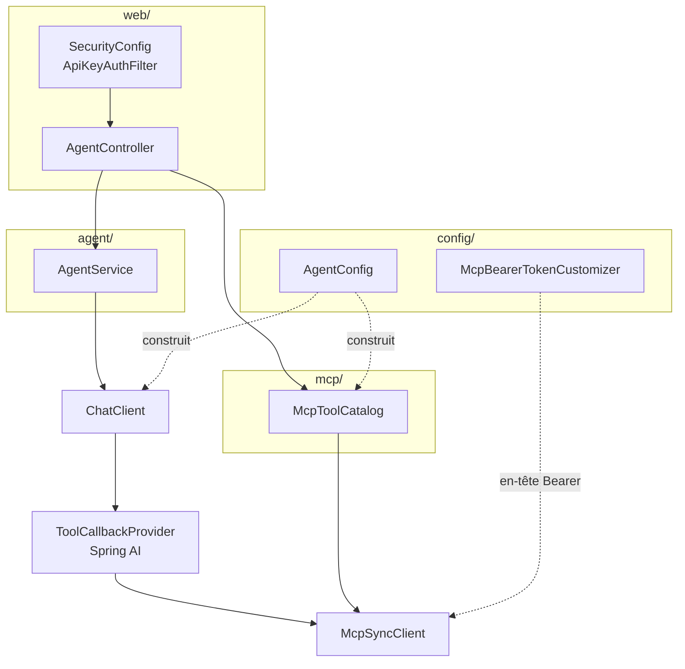
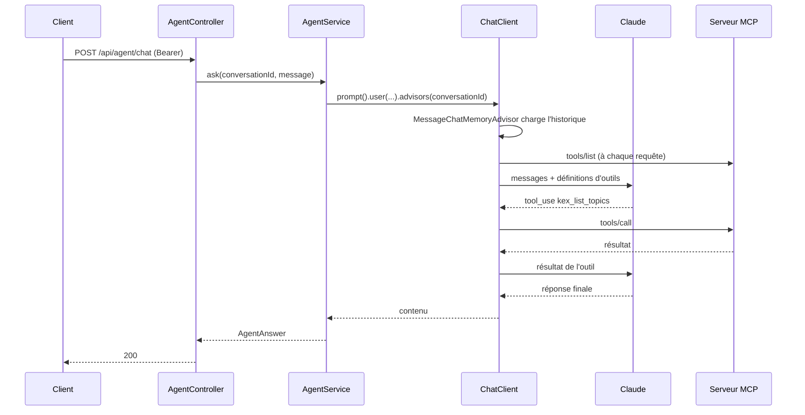

# Architecture

Ce document explique **comment l'agent est construit et pourquoi**. Les décisions y sont données
avec la raison qui les a produites — souvent un comportement observé, pas une préférence.

## Les pièces



| Classe | Rôle |
|---|---|
| `AgentController` | Les 7 routes REST et la traduction des erreurs MCP en codes HTTP |
| `AgentService` | Conversation : identifiant, mémoire, appel bloquant ou flux |
| `McpToolCatalog` | Introspection et invocation directe des serveurs MCP |
| `AgentConfig` | Construit le `ChatClient`, la mémoire, le catalogue |
| `McpBearerTokenCustomizer` | Injecte `Authorization: Bearer` sur les transports MCP HTTP |
| `SecurityConfig` + `ApiKeyAuthFilter` | Bearer statique sur `/api/**` |
| `SupervisionService` | Le cycle : observer, analyser, décider, agir ; la politique et l'audit |
| `SupervisionController` | Le Control Center côté API : vue d'ensemble, décisions, politique, audit |
| `CycleAnalysis` | Le schéma imposé au modèle et la lecture défensive de ce qu'il rend |
| `KafkaViewService` | Vue technique du cluster : traduit les outils MCP, ne recalcule aucune sémantique Kafka |
| `static/` | La Control Center : console d'exploitation servie par l'agent, sans étape de build |

## Le cycle d'une requête



La boucle outil ↔ modèle est tenue par Spring AI, pas par ce code. Ce qui est à nous : le choix des
outils exposés, la mémoire, les plafonds, et la traduction des erreurs.

## Décisions

### Initialisation paresseuse des clients MCP

`spring.ai.mcp.client.initialized: false`.

En initialisation hâtive (le défaut), l'autoconfiguration appelle `initialize()` sur chaque client
pendant le refresh du contexte. Constaté en démarrant le JAR avec l'Explorer éteint :

```
Failed to instantiate [java.util.List]: Factory method 'mcpSyncClients' threw exception
with message: Client failed to initialize by explicit API call
```

L'agent ne démarrait pas parce qu'un service tiers était éteint. En paresseux, il démarre, et
`McpToolCatalog` retente l'initialisation à chaque accès — un serveur qui arrive en retard est
rattrapé sans redémarrage. C'est aussi ce qui permet au service `agent` de docker compose de ne pas
attendre la sonde de santé de l'Explorer.

### Les serveurs sont adressés par clé de connexion

`/api/agent/mcp/servers/{connection}/...` prend la clé de configuration
(`…connections.<clé>`), pas le nom que le serveur annonce.

La raison est directe : le nom annoncé n'existe qu'après le handshake. Avec l'initialisation
paresseuse, adresser par nom annoncé rendrait un serveur non initialisé **inadressable**, donc
impossible à réveiller. La clé de connexion, elle, est connue dès le démarrage.

`GET /api/agent/mcp/servers` renvoie les deux : `connection` (la clé, celle qui adresse) et
`serverName` (ce que le serveur dit être, `null` tant qu'il n'a pas répondu).

### Le bearer MCP est filtré par préfixe d'URL

Le transport streamable-HTTP de Spring AI n'a pas de propriété d'en-tête. Le point d'extension est
`McpSyncHttpClientRequestCustomizer` — mais un tel bean s'applique à **toutes** les connexions HTTP
MCP. Tel quel, le jeton de l'Explorer partirait aussi vers n'importe quel autre serveur MCP
configuré.

D'où `kex.mcp.bearer-tokens[]`, une liste de couples `url-prefix` / `token` : le customizer ne pose
l'en-tête que sur les requêtes dont l'URI commence par le préfixe déclaré.

### Plafond de la boucle d'outils

```yaml
spring.ai.tools.limits.max-total-tool-calls: 20
spring.ai.tools.limits.on-limit-exceeded: return_error_response
```

Sans plafond, un modèle qui s'entête sur un outil tourne jusqu'au timeout HTTP, à vos frais.
`RETURN_ERROR_RESPONSE` plutôt que `THROW` : le modèle reçoit l'erreur et conclut, là où l'exception
rendrait une 500 sans réponse à l'appelant.

### Deux fournisseurs de modèle, un seul activé

Le classpath porte les starters Anthropic et OpenAI ; `spring.ai.model.chat` — réglé par
`KEX_AGENT_LLM_PROVIDER` — désigne celui qui s'active. OpenRouter parle l'API d'OpenAI, c'est donc
le client OpenAI pointé sur `https://openrouter.ai/api/v1`, sans une ligne de code applicatif :
`AgentConfig` reçoit un `ChatClient.Builder` et ne sait pas d'où il vient.

Cette propriété n'est pas cosmétique. Chaque autoconfiguration de modèle de Spring AI s'active en
l'absence de propriété (`matchIfMissing`) : sans elle, les deux déclarent leur `ChatModel` et le
contexte échoue au démarrage sur un bean ambigu. Même raison pour les modalités que le starter
OpenAI apporte en prime — embeddings, images, modération, audio — toutes à `none` : elles
exigeraient une clé, et un `EmbeddingModel` apparu sans qu'on le demande satisferait en silence la
base de connaissance, qui doit rester un choix explicite. `LlmProviderTest` verrouille les deux
comportements plutôt que la documentation seule.

Ce que la bascule coûte est dit dans [CONFIGURATION.md](CONFIGURATION.md#choisir-le-fournisseur-de-modele) :
une passerelle hébergée voit passer les prompts et les résultats d'outils, l'appel d'outils — dont
cet agent ne peut pas se passer — dépend du modèle choisi, et la sortie structurée du cycle de
supervision aussi.

Le fournisseur retenu sans clé ne fait pas échouer le démarrage : `LlmProviderCheck` le signale et
laisse l'application monter. Même posture que `kex.agent.api-key` — `/actuator/health`, la console
et l'introspection MCP doivent rester joignables, puisque c'est là qu'on ira regarder pourquoi rien
ne répond.

### Mémoire : en mémoire par défaut, partagée sur demande

`MessageWindowChatMemory` sur `InMemoryChatMemoryRepository`. Deux instances derrière un load
balancer ne verraient pas les mêmes conversations.

Le profil `shared-memory` bascule sur PostgreSQL. Il ne pouvait pas être le défaut : le simple fait
d'avoir le starter JDBC sur le classpath fait échouer le démarrage sans base
(`Failed to determine a suitable driver class`). Les autoconfigurations JDBC sont donc exclues dans
`application.yml`, et le profil **annule** cette liste — une liste de propriétés n'est pas fusionnée
entre sources, la source la plus prioritaire gagne en entier.

### Le flux SSE porte son identité et ses erreurs

`POST /chat/stream` rendait un flux de texte nu. Deux défauts qui n'en sont pas moins réels pour
être discrets :

- l'identifiant de conversation généré quand le client n'en fournit pas n'était **jamais rendu** :
  la conversation était écrite en mémoire sous une clé que personne ne connaissait, donc impossible
  à poursuivre et impossible à purger par `DELETE /conversations/{id}` ;
- une erreur en cours de flux fermait la connexion sans un mot, et une réponse tronquée est
  indiscernable d'une réponse complète côté client.

Le flux émet donc des événements nommés : `conversation` (l'identifiant, en premier), `token`, et
`error` en cas d'échec. Le détail de l'exception reste dans les journaux ; l'appelant reçoit un
message court.

### Les outils exécutés sont rendus à l'appelant

Les observations de Spring AI donnent des métriques agrégées ; elles ne disent pas ce qu'un échange
précis a fait. `RecordingToolCallbackProvider` enveloppe chaque outil et mesure son appel, et le
résultat sort par deux chemins : un événement `tool` dans le flux, et le champ `tools` de la réponse
bloquante.

Le collecteur voyage dans le `ToolContext` de la requête, **pas** dans un ThreadLocal : la boucle
d'outils du chemin en flux s'exécute sur des threads Reactor, où un ThreadLocal ne suit pas.

Ce choix a un piège, et il est testé : le convertisseur par défaut de Spring AI
(`ToolContextToMcpMetaConverter.defaultConverter()`) recopie **tout** le `ToolContext` dans le
`_meta` envoyé au serveur MCP à chaque appel d'outil. Laissé tel quel, le collecteur — non
sérialisable — serait poussé sur le réseau. Le convertisseur déclaré ici filtre les clés préfixées
`kex.` et laisse passer le reste, pour les serveurs qui exploitent ce champ.

### Sortie structurée contre un schéma d'appelant

Les convertisseurs de Spring AI partent d'un type Java ; ici le schéma n'est connu qu'à la requête.
`JsonSchemaOutputConverter` implémente `StructuredOutputConverter` en décrivant le schéma au modèle
et en renseignant aussi `getJsonSchema()`, que les fournisseurs capables de contraindre le décodage
utilisent au lieu d'espérer que le modèle lise la consigne.

Une réponse non conforme rend `502`, pas `400` : le contrat n'a pas été tenu en amont, l'appelant
n'a rien fait de mal. Un schéma vide, lui, rend `400`.

### Plafond de durée d'un échange

`kex.agent.request-timeout`, 120s par défaut. `spring.ai.mcp.client.request-timeout` borne *chaque*
appel MCP, pas l'échange : avec vingt tours d'outils autorisés, le pire cas gardait une connexion
HTTP ouverte une vingtaine de minutes.

Les deux chemins ne sont pas équivalents, et c'est assumé :

- **flux** — `Flux.timeout` annule réellement l'amont ;
- **bloquant** — l'appel de Spring AI n'est pas interruptible. Le plafond borne l'attente de
  l'appelant (`504`), pas le travail, qui continue jusqu'à son terme sur un thread virtuel où un
  orphelin coûte une pile et non un thread noyau. `spring.threads.virtual.enabled` est activé pour
  cette raison.

### L'endpoint d'appel direct

<a id="the-direct-tool-endpoint"></a>

`POST /api/agent/mcp/servers/{connection}/tools/{tool}` exécute un outil MCP **sans modèle dans la
boucle**. C'est utile pour tester un serveur ou l'orchestrer depuis du code, et c'est une arme
chargée : rien ne filtre ce qui est appelé, à part le bearer de l'agent et les garde-fous du serveur
MCP lui-même.

Les codes de retour disent quoi :

| Situation | Code |
|---|---|
| Connexion inconnue | `404` |
| Serveur injoignable | `503` |
| Capacité `resources` non exposée (lecture) | `501` |
| Erreur protocole MCP | `502` |
| Échec de l'outil (`isError`) | `200` avec `error: true` |

Le dernier n'est pas une erreur HTTP : l'appel RPC a abouti, c'est l'outil qui a refusé. Confondre
les deux ferait passer « fichier absent » pour « serveur en panne ».

### Sécurité : fermé par défaut

Sans `kex.agent.api-key`, `/api/**` répond `503` — pas `200`, pas `401`. Un `401` laisserait croire
à une erreur d'appelant alors que rien ne peut réussir ; un `200` livrerait un agent ouvert.

Le refus est porté par l'`AuthenticationEntryPoint`, pas par le filtre. Première version : le filtre
court-circuitait en 503, ce qui bloquait aussi `/actuator/health` déclaré en `permitAll` — les
sondes de conteneur tombaient. Le test `ApiSecurityUnconfiguredTest` l'a attrapé, et c'est
maintenant la forme du code qui l'empêche : le filtre authentifie, l'entry point refuse, et il n'est
invoqué que pour une route réellement protégée.

### Le cycle de supervision ne part que sur demande

Pas de `@Scheduled`. En multi-instance, chaque réplique lancerait son propre cycle : deux analyses
sur les mêmes faits, donc deux décisions et deux exécutions de la même action. Ordonnancer suppose
un verrou partagé, donc une base — une décision d'exploitation qui n'a pas à être prise ici, et qui
serait invisible dans un fichier de configuration.

À l'intérieur d'une instance, un `ReentrantLock.tryLock()` refuse un second cycle concurrent plutôt
que de le mettre en file : une file ne ferait que différer le doublon.

La conversation du cycle est jetable (`supervision-<cycleId>`, purgée en `finally`). Réutiliser un
identifiant ferait grossir la mémoire à chaque exécution jusqu'au plafond, en payant du contexte
pour des faits périmés.

### L'autonomie se règle par capacité, le mode ne peut que restreindre

`SupervisionPolicy.effectiveAutonomy` croise le mode global et l'autonomie déclarée d'une capacité,
et ne retient jamais la plus permissive des deux. Sans cette règle, passer le mode en automatique
ouvrirait d'un coup des actions que quelqu'un avait délibérément mises sous supervision — le genre
d'élargissement qu'on ne voit qu'après coup.

Une capacité absente de la politique est `FORBIDDEN`, pas permissive : même posture que l'API, qui
répond `503` sans clé plutôt que de s'ouvrir. Et le droit d'agir ne suffit pas : sans outil MCP lié
à la capacité, l'exécution échoue en le disant, au lieu de réussir à moitié.

La même doctrine s'applique au plancher de confiance, sur une seconde dimension :
`confidenceThresholdOf` retient le maximum du plancher global et de celui déclaré pour la capacité.
Un réglage par capacité ne peut donc que *durcir*. Laisser l'inverse rendrait le plancher global
illisible — sa valeur ne dirait plus rien tant qu'on n'a pas relu chaque ligne de la politique pour
vérifier qu'aucune ne le contourne. Une capacité qui doit se déclencher plus facilement se traite
en abaissant le plancher global et en relevant celui des capacités coûteuses.

L'écran Agent affiche les deux colonnes — déclarée et effective — et la confiance à partir de
laquelle chaque action autonome part réellement. Régler une autonomie sans voir ce qu'elle donnera
vraiment, c'est régler à l'aveugle. Le champ de plancher affiche d'ailleurs la valeur *appliquée*
et non celle qui est stockée : un réglage sous le plancher global n'a aucun effet, et le laisser à
l'écran rendrait le champ invalide au regard de son propre minimum — formulaire insoumettable, sans
rien pour l'expliquer.

### La sortie du modèle est contrainte, pas garantie

`CycleAnalysis` impose un schéma, puis lit la réponse défensivement. Un champ manquant, un état
inconnu, une confiance à 3,2, un processus inventé : rien de tout cela ne fait échouer le cycle, et
rien n'est deviné. Un état illisible devient `UNKNOWN` — jamais `OK` : une anomalie mal formée ne
doit pas effacer les vingt-trois processus analysés correctement, et un processus dont on ne sait
rien ne doit pas ressembler à un processus sain.

Par la même logique, un processus déclaré mais absent de la réponse reste affiché en `UNKNOWN` au
lieu de disparaître : le faire sortir du tableau le ferait passer pour surveillé alors qu'il ne
l'est pas. `CycleAnalysisTest` fixe chacun de ces cas.

### Un relevé partiel prouve une présence, jamais une absence

Les outils MCP de Kafka SQL Explorer portent une enveloppe `coverage` : ce qui a été lu, ce qui ne
l'a pas été — **nommé, pas compté** — et pourquoi le relevé s'est arrêté. Elle existe pour une
raison précise, que sa propre spécification place en tête de ses risques : un agent qui reçoit une
liste vide conclut « ça n'existe pas » là où la phrase vraie est « ce n'était pas dans ce que j'ai
regardé ».

Notre cycle l'ignorait. Le prompt interdisait d'inventer une valeur, mais rien ne disait au modèle
de lire la couverture : un `kex_trace_key` coupé sur `TIME_BUDGET` pouvait donc ressortir en `OK`,
et un cycle vert masquer une panne restée dans la part non lue.

La règle est maintenant explicite des deux côtés. Le prompt exige de lire `stopReason` avant de
conclure, de suivre les verdicts des outils plutôt que de réinterpréter les nombres, de ne jamais
lire une valeur non mesurée comme un zéro, et de poursuivre un `resumeToken` quand le budget le
permet. Le schéma fait de `coverage` un champ **exigé** de chaque relevé.

Côté lecture, `CycleAnalysis.concluded` applique l'asymétrie qui compte :

- un `OK` rendu sur une passe **explicitement** incomplète redevient `UNKNOWN` — l'anomalie était
  peut-être précisément dans ce qui n'a pas été lu ;
- un `WARNING` ou un `ERROR` tiennent : ce qui a été vu a bien été vu ;
- une couverture simplement **non remontée** (`NOT_REPORTED`) ne dégrade rien. La plupart des
  serveurs MCP ne portent pas d'enveloppe, et tout basculer en `UNKNOWN` rendrait le tableau de
  bord inutilisable partout ailleurs que devant Kafka SQL Explorer. Ni complet, ni déclaré
  incomplet : l'écran le dit au lieu de trancher.

Un `complete: true` sans `stopReason: EXHAUSTED` n'est pas retenu : le drapeau est une opinion du
modèle, le motif d'arrêt est ce que l'outil a réellement rendu.

Comme un relevé partiel donne `UNKNOWN`, il fait basculer l'agent en `DEGRADED` par le chemin qui
existait déjà — un processus dont on ne sait rien ne ressemble pas à un processus sain.

### La vue technique traduit, elle ne recalcule pas

`kafka/` appelle `kex_list_topics` et `kex_consumer_lag` et traduit leur réponse. Toute la
sémantique Kafka reste chez Kafka SQL Explorer : les verdicts de retard (`CAUGHT_UP`, `BEHIND`,
`STALLED`) sont repris **tels quels** plutôt que relus depuis les nombres — c'est l'outil qui sait
qu'un retard sans membre assigné ne se résorbera pas de lui-même, et le recalculer ici reviendrait
à réimplémenter sa sémantique moins bien.

`MeasuredValue` prolonge la même règle que `Coverage` d'un cran : une mesure absente n'est pas
zéro. Un lag à `0` affirme « rattrapé » ; les confondre fait lire un consumer à l'arrêt comme un
consumer à jour. L'écran affiche « non mesuré » avec le motif en infobulle, jamais un tiret
ambigu ni un chiffre.

L'écart entre `groupsExamined` et `groupsInCluster` est affiché pour la même raison : le taire
ferait lire une liste courte comme une liste complète.

Rien n'y lève d'exception vers l'appelant. Un outil absent, un serveur injoignable ou une réponse
illisible produisent une vue vide **qui dit pourquoi**, en `200`. Un serveur MCP absent est une
information d'exploitation, pas une panne de l'agent : rendre une erreur HTTP ferait tomber l'écran
au lieu de l'informer.

Les noms d'outils sont configurables. L'agent peut être branché sur un autre serveur MCP, et une
vue qui échoue en nommant l'outil attendu se règle — une vue qui échoue en silence se contourne.

### Ce que le serveur MCP de Kafka SQL Explorer expose réellement

Vérifié dans son dépôt, pas dans sa spécification : quinze outils, **tous en lecture seule**
(`kex_list_topics`, `kex_describe_topic`, `kex_preview_messages`, `kex_infer_schema`,
`kex_sql_query`, `kex_list_tables`, `kex_trace_key`, `kex_resume_trace`, `kex_compare_traces`,
`kex_deduce_data_model`, `kex_build_join`, `kex_run_audit`, `kex_get_audit`, `kex_consumer_lag`,
`kex_suggest_kpis`). `MutatingMcpTools` est une interface sans implémentation, `readonly` vaut
`true` en dur, et les mutations d'administration sont hors de son périmètre déclaré.

Conséquence pour nos capacités : aucune n'a de contrepartie sur ce serveur. Devant lui, l'agent
observe et recommande — il n'agit pas. Ce n'est pas un cas dégradé, c'est l'état nominal, et le
chemin « aucun outil MCP lié à la capacité » le rend déjà explicite plutôt que de laisser croire à
une exécution.

### Une alerte est un symptôme dédupliqué, pas un relevé

Deux cycles qui voient le même retard sur le même processus signalent un incident, pas deux. Les
anomalies brutes sont regroupées par `processId + titre` : l'alerte porte alors un compteur, une
date de première apparition et la dernière analyse en date.

Seul le dernier cycle décide qu'une alerte est active. Une alerte qui ne réapparaît pas a cessé
d'être vraie, et la laisser à l'écran ferait traiter un incident déjà passé — mais son historique
reste, ce qui distingue un symptôme qui dure d'un pic isolé.

La priorisation est calculée côté serveur, pas dans la console : gravité d'abord, puis nombre de
relevés, puis fraîcheur. Une alerte porte aussi la décision en attente qui lui correspond, pour que
l'action soit à portée de clic plutôt qu'à chercher dans un autre écran.

`GET /api/agent/supervision/anomalies` a été retiré au profit de `/alerts` : un point d'entrée sans
consommateur est de la surface publique à maintenir pour personne. Les relevés bruts restent
internes au service.

### Mesurer l'agent sans inventer de chiffre

`GET /api/agent/supervision/performance` rend ce que l'agent fait de lui-même : cycles, détections,
décisions autonomes contre validations humaines, actions réussies ou en échec, délais.

Trois précautions y sont prises, et ce sont elles qui comptent :

- **Le taux de pertinence ne se calcule que sur les verdicts humains** — approbations contre refus.
  Une exécution autonome n'y entre pas : l'agent ne se confirme pas lui-même. Tant que personne n'a
  tranché, le taux est `null` et l'interface dit pourquoi, là où un `0` se lirait « l'agent se
  trompe toujours ».
- **La durée moyenne d'un cycle n'est pas présentée comme un délai de détection.** Celui-ci se
  compterait depuis le début de l'incident, que rien ici ne connaît. Le délai de dénouement d'une
  décision, lui, est réellement mesuré.
- **Tout porte sur la fenêtre d'historique conservée**, pas depuis le premier jour. L'interface
  l'affiche, faute de quoi un compteur qui retombe passerait pour une amélioration.

`DecisionStatus.EXPIRED` est distinct de `FAILED` pour la même raison : confondre « l'outil a
échoué » et « personne n'a répondu » masquerait un défaut d'organisation en défaut technique.

### L'historique est en mémoire, donc mono-instance

Cycles, anomalies, décisions et audit vivent dans des `History` bornés, en mémoire du processus.
Derrière un load balancer, chaque réplique tiendrait le sien et l'audit serait partiel. C'est
assumé et écrit ici plutôt que masqué : la persistance partagée est une décision d'exploitation,
au même titre que le profil `shared-memory` pour la mémoire de conversation.

L'acteur inscrit à l'audit est le principal authentifié. Le bearer étant unique et partagé, il
désigne le jeton, pas une personne : tracer une identité que le système ne connaît pas serait une
fiction, et l'audit n'en vaudrait rien.

### Une demande de validation expire

Approuvée trois heures après les faits, une action agirait sur une situation qui n'existe plus. Les
demandes dépassant `approval-timeout` basculent en `FAILED` à la lecture suivante, avec leur trace
d'audit. L'expiration est évaluée à la lecture et non par une tâche de fond : sans planificateur,
une tâche de plus serait le seul composant à tourner tout seul.

### La console est servie ouverte, mais n'ouvre rien

`src/main/resources/static/` porte la Control Center : conversation en flux, introspection MCP,
invocation directe d'un outil, base de connaissance, santé. Trois fichiers statiques, aucun
outillage JavaScript — le projet est construit par Maven, et ajouter npm ferait vivre deux chaînes
de build pour trois fichiers.

`GET /`, `/index.html` et `/assets/**` sont en `permitAll`, comme Swagger UI et pour la même raison :
c'est du HTML inerte qui ne porte aucun secret, et l'authentifier empêcherait le navigateur de
charger la page qui *demande* le jeton. Trois garde-fous encadrent cette ouverture, tous tenus par
`ConsoleTest` :

- elle est restreinte au `GET` — un `POST` sur les mêmes chemins reste authentifié ;
- les chemins sont énumérés plutôt que couverts par un joker de racine, pour qu'une future route
  servie ici n'hérite pas de l'ouverture ;
- `/api/**` et `/actuator/prometheus` répondent toujours `401` sans jeton.

Le jeton est saisi dans le navigateur et vit en `sessionStorage` : il disparaît à la fermeture de
l'onglet et n'est jamais écrit côté serveur. Les réponses du modèle et les contenus MCP sont
injectés par `textContent`, jamais par `innerHTML` : ce sont des données non fiables, et un serveur
MCP hostile pourrait sinon placer un XSS sur la même origine que l'API.

## Ce que les tests couvrent

| Test | Ce qu'il verrouille |
|---|---|
| `McpStreamableHttpIntegrationTest` | Le transport MCP réel, bearer compris, sur un serveur HTTP monté dans le test |
| `ApiSecurityTest` / `…UnconfiguredTest` | 401 / 200 / 503, et la sonde de santé jamais bloquée |
| `McpToolCatalogTest` | Introspection, appel, ressources, serveur injoignable, capacité absente |
| `AgentServiceTest` | Propagation du `conversationId` à l'advisor de mémoire |
| `AgentControllerTest` | Contrat HTTP des 7 routes |
| `SharedMemoryProfileTest` | Le profil `shared-memory` remplace bien le dépôt en mémoire |
| `KexAgentApplicationTests` | Le contexte démarre sans aucun serveur MCP configuré |
| `ConsoleTest` | La console est servie sans jeton, n'ouvre ni `/api/**` ni le `POST`, et appelle les routes qui existent |
| `KafkaViewServiceTest` | La traduction des outils sur des charges utiles conformes à la forme réelle d'Explorer : mesure absente jamais lue comme zéro, verdict repris tel quel, serveur injoignable rendu en vue vide motivée |
| `SupervisionCycleIntegrationTest` | Le cycle jusqu'à un appel d'outil MCP réel : contexte Spring complet, transport streamable-HTTP, bearer, audit. Seul le modèle est simulé |
| `SupervisionServiceTest` | Autonomie, seuil de confiance, expiration, pause, cycle en échec, péremption des données |
| `CycleAnalysisTest` | Ce qui arrive quand le modèle rend autre chose que le schéma demandé, et l'asymétrie de la couverture : un `OK` partiel devient `UNKNOWN`, une erreur partielle reste une erreur |
| `SupervisionControllerTest` | Contrat HTTP du Control Center, dont 409 sur conflit d'état et 404 sur décision inconnue |
