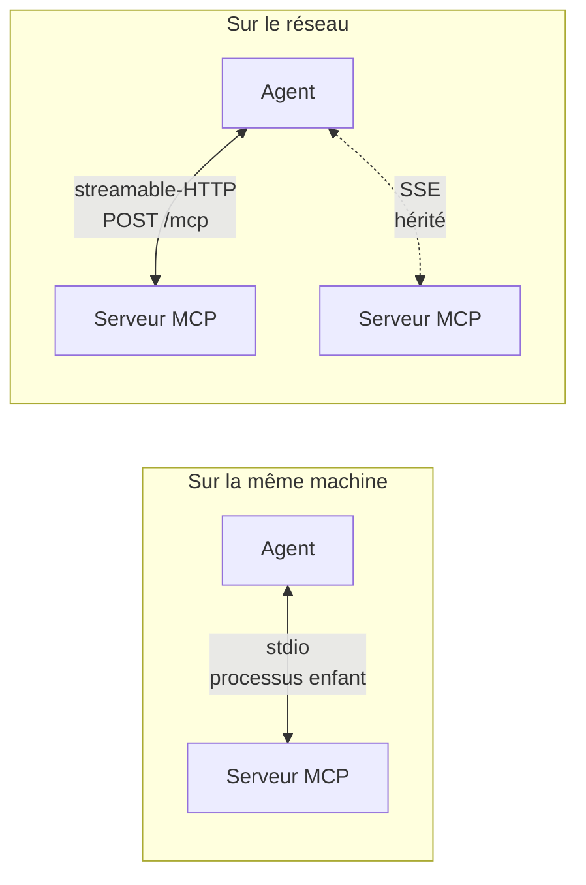
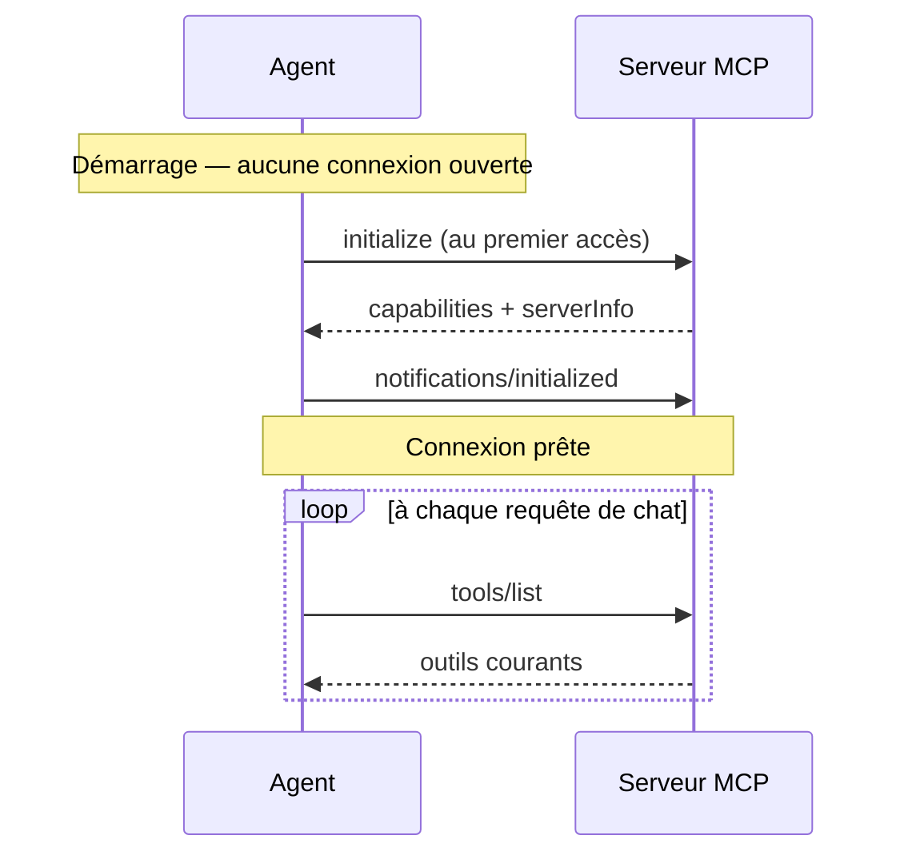

# MCP, de zéro

Ce document est pédagogique : il part du problème, explique le protocole, puis montre comment
brancher un serveur sur cet agent et comment en écrire un.

## Le problème que MCP résout

Un modèle de langage ne sait que ce qu'il a lu à l'entraînement, plus ce qu'on lui met dans le
prompt. Demandez-lui *« combien de messages dans demo.orders ? »* et il produira une réponse
plausible — c'est-à-dire fausse, avec aplomb.

La parade est le **tool calling** : on décrit au modèle des fonctions qu'il peut demander, il
répond « appelle `list_topics` », le programme exécute, renvoie le résultat, le modèle continue.
Chaque intégration était jusqu'ici du code sur mesure, à réécrire pour chaque modèle et chaque
application.

**MCP (Model Context Protocol)** normalise ce contrat. Un serveur MCP déclare ce qu'il sait faire ;
n'importe quel client MCP le découvre et l'utilise, sans code d'intégration. Ce que l'agent y gagne :
brancher Kafka SQL Explorer coûte ici **six lignes de YAML**, pas un module.

## Ce qu'un serveur MCP expose

| Primitive | Ce que c'est | Qui décide de l'utiliser |
|---|---|---|
| **Tools** | Des actions : `kex_list_topics`, `kex_sql_query` | Le modèle |
| **Resources** | Des données adressables par URI : `kafka://cluster/topics` | L'application |
| **Prompts** | Des gabarits de prompts réutilisables | L'utilisateur |

Cet agent consomme les **tools** (automatiquement présentés au modèle) et les **resources**
(exposées en REST, pas injectées dans le prompt). Un serveur n'est pas obligé d'avoir les trois :
Kafka SQL Explorer, par exemple, n'expose que des outils.

## Les trois transports



| Transport | Quand | Configuration |
|---|---|---|
| **stdio** | Le serveur est un exécutable local ; l'agent le lance comme processus enfant | `spring.ai.mcp.client.stdio.connections` |
| **streamable-HTTP** | Le serveur est un service réseau. C'est le transport HTTP actuel | `…streamable-http.connections` |
| **SSE** | Transport HTTP historique, encore servi par des serveurs anciens | `…sse.connections` |

Les trois sont disponibles ici sans dépendance supplémentaire : `spring-ai-starter-mcp-client`
apporte le client et les transports basés sur le `HttpClient` du JDK.

## Brancher un serveur

### Un serveur local (stdio)

```yaml
spring:
  ai:
    mcp:
      client:
        stdio:
          connections:
            filesystem:
              command: npx
              args: ["-y", "@modelcontextprotocol/server-filesystem", "/data"]
              env:
                LOG_LEVEL: info
```

`filesystem` est la **clé de connexion** : c'est elle qui adresse le serveur dans l'API
(`/api/agent/mcp/servers/filesystem/...`), pas le nom que le serveur annoncera.

### Un serveur distant (streamable-HTTP)

```yaml
spring:
  ai:
    mcp:
      client:
        streamable-http:
          connections:
            kafka-explorer:
              url: http://localhost:8080
              endpoint: /mcp
```

### Un serveur authentifié

Le transport de Spring AI ne porte pas d'en-têtes dans ses propriétés. L'agent ajoute donc :

```yaml
kex:
  mcp:
    bearer-tokens:
      - url-prefix: http://localhost:8080
        token: ${EXPLORER_MCP_AUTH_TOKEN}
```

`Authorization: Bearer …` n'est posé que sur les requêtes dont l'URI commence par `url-prefix`.
C'est délibéré : un customizer s'applique à toutes les connexions HTTP, et sans ce filtre le jeton
d'un serveur partirait aussi vers les autres.

### Administrer les serveurs depuis la console

La vue **Technique → Serveurs MCP** ajoute des connexions sans redémarrer. L'assistant teste le
handshake et découvre les outils avant tout enregistrement. Il permet ensuite de désactiver,
modifier, rafraîchir, diagnostiquer ou retirer le serveur, de limiter les outils présentés au
modèle, et de les associer à des capacités métier.

Les connexions de la console restent en mémoire tant que `KEX_MCP_STORAGE_KEY` est vide. Une fois
cette clé définie, la configuration complète — en-têtes, bearer et environnement compris — est
écrite sous forme chiffrée et authentifiée AES-GCM dans `.kex/mcp-servers.enc` (chemin surchargeable
par `KEX_MCP_STORAGE_PATH`). L'export JSON exclut toujours les secrets et l'import laisse les
connexions désactivées jusqu'à leur reconfiguration.

Un transport stdio lance un processus sur la machine de l'agent. Il est donc refusé par défaut,
même à un administrateur. Les commandes permises doivent être énumérées explicitement :

```bash
export KEX_MCP_STDIO_ALLOWED_COMMANDS=npx,uvx
```

Les arguments ne passent jamais par un shell et l'environnement transmis est limité aux valeurs
configurées, en plus de la liste minimale héritée par le SDK MCP.

### Vérifier

```bash
curl -H "Authorization: Bearer $KEX_AGENT_API_KEY" \
     localhost:8081/api/agent/mcp/servers
```

```json
[{"connection":"kafka-explorer","serverName":"kafka-explorer-mcp","version":"0.1.0",
  "protocolVersion":"2025-06-18","initialized":true,
  "tools":[{"name":"kex_list_topics","description":"…"}]}]
```

`initialized: false` avec une liste d'outils vide veut dire que le serveur n'a pas encore répondu —
les clients sont initialisés paresseusement et chaque appel retente. Un `503` sur un appel d'outil
confirme qu'il est injoignable.

## Ce qui se passe au démarrage et à chaque requête



`tools/list` est rejoué à chaque requête : un serveur qui publie un nouvel outil est pris en compte
sans redémarrer l'agent.

## Écrire son propre serveur MCP

Le plus simple, en Java, est Spring AI côté serveur — c'est ce que fait Kafka SQL Explorer :

```java
@Component
class WeatherMcpTools {

    @McpTool(name = "get_forecast", description = "Prévisions pour une ville")
    String forecast(@McpToolParam(description = "Nom de la ville") String city) {
        return service.forecast(city);
    }
}
```

Avec `spring-ai-starter-mcp-server-webmvc`, la méthode est scannée, décrite au format JSON Schema et
servie sur `/mcp`. Trois principes valent la peine d'être repris de l'Explorer :

1. **Le garde-fou est à l'enregistrement, pas à l'invocation.** Un outil qui existe comme bean est
   listé par `tools/list` quoi que son corps refuse ensuite. Pour qu'un outil soit réellement
   indisponible, son bean ne doit pas exister.
2. **Un outil répond à une question, il ne rend pas de la matière première.** `trace_key` vaut mieux
   que six `consume_messages` que le modèle devra corréler lui-même.
3. **Une mesure qui a échoué n'est jamais zéro.** `0` est une affirmation ; publiée à un modèle,
   elle produit une conclusion fausse et confiante. `null` avec une raison est honnête.

## Pour aller plus loin

- [Spécification MCP](https://modelcontextprotocol.io) — le protocole lui-même
- [Référence Spring AI MCP](https://docs.spring.io/spring-ai/reference/api/mcp/mcp-overview.html)
- [`docs/ARCHITECTURE.md`](ARCHITECTURE.md) — comment cet agent s'en sert, et pourquoi ainsi
