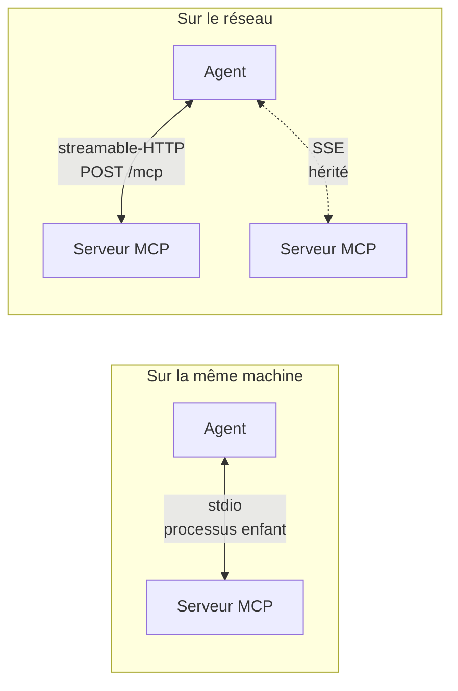
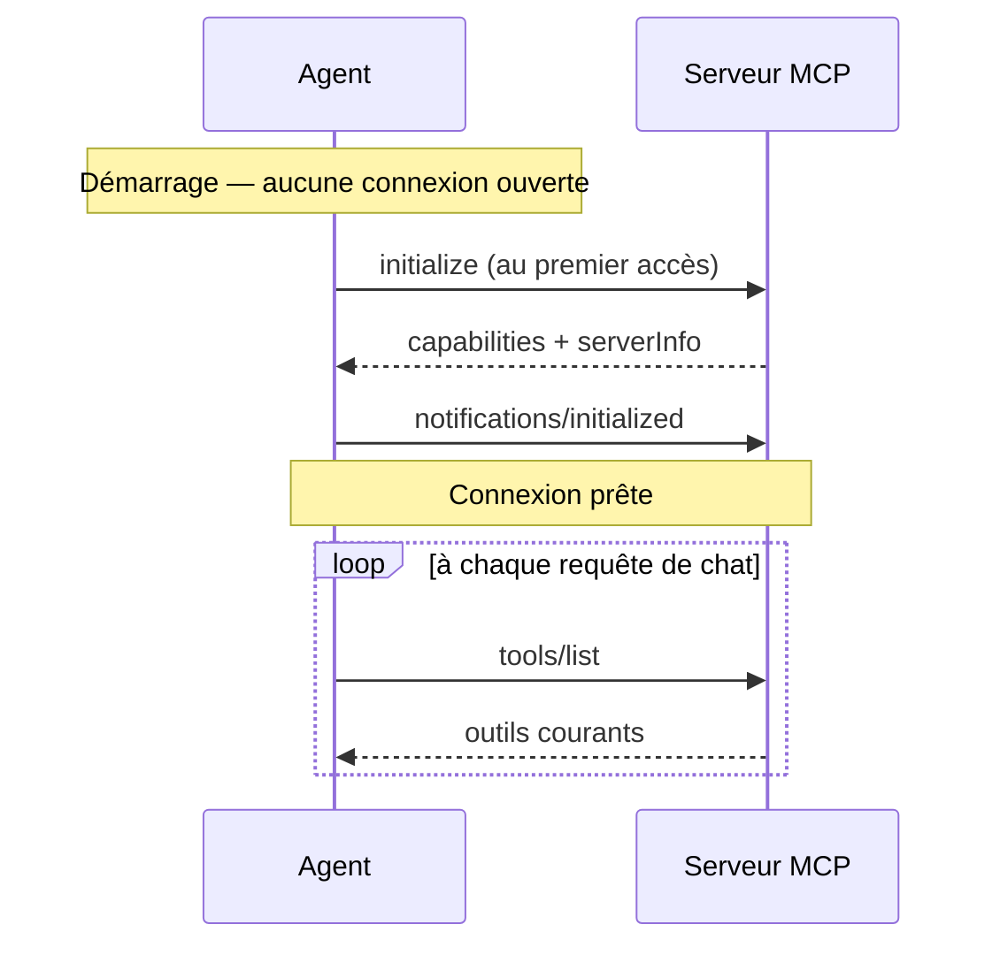

# MCP, de zéro

## Revues opérationnelles Kafka

Pour une demande portant sur la configuration des topics, le lag ou les DLQ, l'agent
dispose de procédures de lecture intégrées. Elles s'appuient sur les outils de
KafkaExplorer `kex_topic_configuration`, `kex_topic_policy_review`,
`kex_consumer_lag_trend` et `kex_dlq_review`
en complément des diagnostics déjà présents. La configuration et les réplicas se
lisent avec les exigences du cluster concerné ; un topic sans groupe consommateur
n'est pas automatiquement orphelin. Une politique de topic n'est appliquée que si
elle est configurée pour l'environnement demandé. Le premier relevé de lag n'a pas
de tendance ; un volume partagé configuré dans KafkaExplorer permet de retrouver
le relevé sur une autre instance ou après redémarrage. Une DLQ est échantillonnée,
sans retraitement automatique ; ses liens source, retry, surveillance et runbook
sont déclarés par l'opérateur et doivent être vérifiés dans les systèmes concernés.

Ces procédures intégrées sont du code versionné. Les compétences créées ou importées
par un utilisateur suivent toujours le circuit de proposition et de validation humaine.

Ce document est pédagogique : il part du problème, explique le protocole, puis montre comment
brancher un serveur sur cet agent et comment en écrire un.

## Le problème que MCP résout

Un modèle de langage ne sait que ce qu'il a lu à l'entraînement, plus ce qu'on lui met dans le
prompt. Demandez-lui *« combien de messages dans demo.orders ? »* et il produira une réponse
plausible — c'est-à-dire fausse, avec aplomb.

La parade est le **tool calling** : on décrit au modèle des fonctions qu'il peut demander, il
répond « appelle `list_topics` », le programme exécute, renvoie le résultat, le modèle continue.
Chaque intégration était jusqu'ici du code sur mesure, à réécrire pour chaque modèle et chaque
application.

**MCP (Model Context Protocol)** normalise ce contrat. Un serveur MCP déclare ce qu'il sait faire ;
n'importe quel client MCP le découvre et l'utilise, sans code d'intégration. Ce que l'agent y gagne :
brancher Kafka SQL Explorer coûte ici **six lignes de YAML**, pas un module.

## Ce qu'un serveur MCP expose

| Primitive | Ce que c'est | Qui décide de l'utiliser |
|---|---|---|
| **Tools** | Des actions : `kex_list_topics`, `kex_sql_query` | Le modèle |
| **Resources** | Des données adressables par URI : `kafka://cluster/topics` | L'application |
| **Prompts** | Des gabarits de prompts réutilisables | L'utilisateur |

Cet agent consomme les **tools** (automatiquement présentés au modèle) et les **resources**
(exposées en REST, pas injectées dans le prompt). Un serveur n'est pas obligé d'avoir les trois :
Kafka SQL Explorer, par exemple, n'expose que des outils.

## Les trois transports



| Transport | Quand | Configuration |
|---|---|---|
| **stdio** | Le serveur est un exécutable local ; l'agent le lance comme processus enfant | `spring.ai.mcp.client.stdio.connections` |
| **streamable-HTTP** | Le serveur est un service réseau. C'est le transport HTTP actuel | `…streamable-http.connections` |
| **SSE** | Transport HTTP historique, encore servi par des serveurs anciens | `…sse.connections` |

Les trois sont disponibles ici sans dépendance supplémentaire : `spring-ai-starter-mcp-client`
apporte le client et les transports basés sur le `HttpClient` du JDK.

## Brancher un serveur

### Un serveur local (stdio)

```yaml
spring:
  ai:
    mcp:
      client:
        stdio:
          connections:
            filesystem:
              command: npx
              args: ["-y", "@modelcontextprotocol/server-filesystem", "/data"]
              env:
                LOG_LEVEL: info
```

`filesystem` est la **clé de connexion** : c'est elle qui adresse le serveur dans l'API
(`/api/agent/mcp/servers/filesystem/...`), pas le nom que le serveur annoncera.

### Un serveur distant (streamable-HTTP)

```yaml
spring:
  ai:
    mcp:
      client:
        streamable-http:
          connections:
            kafka-explorer:
              url: http://localhost:8080
              endpoint: /mcp
```

### Un serveur authentifié

Le transport de Spring AI ne porte pas d'en-têtes dans ses propriétés. L'agent ajoute donc :

```yaml
kex:
  mcp:
    bearer-tokens:
      - url-prefix: http://localhost:8080
        token: ${EXPLORER_MCP_AUTH_TOKEN}
```

`Authorization: Bearer …` n'est posé que sur les requêtes dont l'URI commence par `url-prefix`.
C'est délibéré : un customizer s'applique à toutes les connexions HTTP, et sans ce filtre le jeton
d'un serveur partirait aussi vers les autres.

### Administrer les serveurs depuis la console

La vue **Technique → Serveurs MCP** ajoute des connexions sans redémarrer. L'assistant teste le
handshake et découvre les outils avant tout enregistrement. Il permet ensuite de désactiver,
modifier, rafraîchir, diagnostiquer ou retirer le serveur, de limiter les outils présentés au
modèle, et de les associer à des capacités métier.

Les connexions de la console restent en mémoire tant que `KEX_MCP_STORAGE_KEY` est vide. Une fois
cette clé définie, la configuration complète — en-têtes, bearer et environnement compris — est
écrite sous forme chiffrée et authentifiée AES-GCM dans `.kex/mcp-servers.enc` (chemin surchargeable
par `KEX_MCP_STORAGE_PATH`). L'export JSON exclut toujours les secrets et l'import laisse les
connexions désactivées jusqu'à leur reconfiguration.

Un transport stdio lance un processus sur la machine de l'agent. Il est donc refusé par défaut,
même à un administrateur. Les commandes permises doivent être énumérées explicitement :

```bash
export KEX_MCP_STDIO_ALLOWED_COMMANDS=npx,uvx
```

Les arguments ne passent jamais par un shell et l'environnement transmis est limité aux valeurs
configurées, en plus de la liste minimale héritée par le SDK MCP.

### Découvrir des serveurs depuis des registres externes

Au-delà des deux entrées curées de `GET /api/agent/mcp/catalog` (GitHub en lecture seule,
Microsoft Learn), `GET /api/agent/mcp/catalog/discover` interroge des registres tiers pour
proposer des candidats non pré-vérifiés par le projet — chacun noté par un calcul de confiance
déterministe plutôt que jugé par le modèle, pour rester reproductible et testable comme toute
autre règle de sécurité de l'agent. Le registre officiel est activé par défaut ; la source Docker
reste optionnelle. Pour modifier ce comportement :

```bash
export KEX_MCP_CATALOG_DOCKER_ENABLED=true
export KEX_MCP_CATALOG_OFFICIAL_REGISTRY_ENABLED=false # désactiver le registre officiel
```

| Source | Ce qu'elle expose |
|---|---|
| Docker MCP Catalog (`hub.docker.com/v2/repositories/mcp/`) | Adoption (tirages, étoiles), fraîcheur ; chaque image `mcp/<nom>` est construite par Docker à partir du dépôt soumis — c'est ce que la note retient pour la provenance de cette source, sans dépendre d'un champ de dépôt que cette API n'expose pas |
| Registre officiel MCP (`registry.modelcontextprotocol.io/v0/servers`) | Dépôt source, paquets déclarés (npm, pypi, cargo, oci, nuget, mcpb), variables d'environnement requises, points d'accès distants, statut et date de mise à jour |

**Note de confiance sur 100**, dix critères pondérés, calculée pour chaque candidat par
`McpTrustScoreCalculator` :

| Critère | Poids |
|---|---|
| Éditeur officiel / identité vérifiée | 20 |
| Provenance source → build vérifiable | 15 |
| Signature / attestation de l'artefact | 10 |
| SBOM disponible | 10 |
| Analyse CVE / dépendances | 10 |
| Projet activement maintenu | 10 |
| Permissions minimales | 10 |
| Outils et effets de bord documentés | 5 |
| Isolation / conteneur disponible | 5 |
| Réputation / adoption | 5 |

Un critère qu'aucune source ne mesure reste `UNKNOWN` — ni compté ni traité comme un échec, même
principe que `Coverage` pour les relevés Kafka. Signature, SBOM et analyse CVE restent `UNKNOWN`
pour tout candidat aujourd'hui : aucune des deux sources branchées ne porte ce signal ; « Éditeur
officiel » n'est retenu que pour un dépôt explicitement ajouté à
`kex.mcp.catalog.trust.trusted-publisher-repositories` (vide par défaut) — le deviner depuis un
nom d'organisation inventerait une confiance que personne n'a accordée.

**Six critères éliminatoires**, indépendants du score, refusent l'installation côté serveur
(`403`) quel que soit le total obtenu — un candidat disqualifié garde sa note affichée, mais
`POST .../install` la refuse toujours :

- binaire sans dépôt source ni paquet issu d'un registre public reconnu ;
- plus de `kex.mcp.catalog.trust.max-required-secrets` secrets requis, ou un nom de variable
  jugé disproportionné (`broad-credential-keywords`) ;
- un argument ou une valeur par défaut qui désigne la racine du système de fichiers ;
- une invocation shell sans paquet de registre public identifié derrière ;
- un point d'accès distant sans en-tête d'authentification déclaré ;
- un point d'accès distant sans description exploitable.

**Installer un candidat** (`POST /api/agent/mcp/catalog/discover/{source}/{id}/install`, `ADMIN`,
`{"connection":"...","bearerToken":"..."}` si requis) rejoue le même `register` que l'ajout manuel
— connexion créée désactivée, testée par un vrai handshake. Deux formes seulement, en attendant
l'introduction d'une correspondance générale pour les autres types de paquets :

- un candidat avec un **point d'accès distant** s'enregistre en transport HTTP ; un modèle d'URL
  (`{variable}`) ou une requête/fragment dans l'URL sont refusés (`400`) plutôt que mal traduits ;
- un candidat **conteneurisé** (source Docker, ou paquet `oci` du registre officiel) s'enregistre
  en transport stdio, `docker run --rm -i <image>` — et exige donc `docker` dans
  `kex.mcp.runtime.allowed-stdio-commands`, comme toute autre commande stdio : la note de confiance
  n'est jamais un raccourci vers cette liste blanche.

### Vérifier

```bash
curl -H "Authorization: Bearer $KEX_AGENT_API_KEY" \
     localhost:8081/api/agent/mcp/servers
```

```json
[{"connection":"kafka-explorer","serverName":"kafka-explorer-mcp","version":"0.1.0",
  "protocolVersion":"2025-06-18","initialized":true,
  "tools":[{"name":"kex_list_topics","description":"…"}]}]
```

`initialized: false` avec une liste d'outils vide veut dire que le serveur n'a pas encore répondu —
les clients sont initialisés paresseusement et chaque appel retente. Un `503` sur un appel d'outil
confirme qu'il est injoignable.

## Ce qui se passe au démarrage et à chaque requête



`tools/list` est rejoué à chaque requête : un serveur qui publie un nouvel outil est pris en compte
sans redémarrer l'agent.

## Exposer Kex comme serveur MCP

Kex peut aussi être consommé par un autre client MCP. Cette surface est **opt-in et en lecture seule**
dans sa première phase. Les mêmes observations sont disponibles comme **tools** (`kex_status`, `kex_overview`,
`kex_alerts`, `kex_incidents`, `kex_pending_decisions`) et comme **resources** stables :
`kex://supervision/status`, `kex://supervision/overview`, `kex://supervision/alerts`,
`kex://supervision/incidents` et `kex://supervision/decisions/pending`. Elle n'expose ni lancement de cycle, ni pause, ni
approbation/rejet de décision.

Activez-la explicitement :

```bash
export KEX_MCP_SERVER_ENABLED=true
export KEX_AGENT_API_KEY="$(openssl rand -hex 32)"
```

Le point d'accès Streamable HTTP est `/api/agent/mcp-server` et réutilise l'authentification
Bearer de Kex. Un appelant doit avoir le rôle `OPERATOR` ou `ADMIN`. Les requêtes de navigateur
avec un en-tête `Origin` sont refusées sauf si l'origine est explicitement ajoutée à
`kex.mcp.server.allowed-origins`; les clients serveur-à-serveur sans `Origin` ne sont pas
concernés.

Cette séparation est intentionnelle : le protocole MCP devient un adaptateur entrant vers les
services Kex existants, pas un second moteur de gouvernance. Les opérations mutantes seront ajoutées
séparément lorsqu'elles pourront conserver les mêmes garanties d'autorisation, d'approbation et
d'audit que l'API opérateur.

## Écrire son propre serveur MCP

Le plus simple, en Java, est Spring AI côté serveur — c'est ce que fait Kafka SQL Explorer :

```java
@Component
class WeatherMcpTools {

    @McpTool(name = "get_forecast", description = "Prévisions pour une ville")
    String forecast(@McpToolParam(description = "Nom de la ville") String city) {
        return service.forecast(city);
    }
}
```

Avec `spring-ai-starter-mcp-server-webmvc`, la méthode est scannée, décrite au format JSON Schema et
servie sur `/mcp`. Trois principes valent la peine d'être repris de l'Explorer :

1. **Le garde-fou est à l'enregistrement, pas à l'invocation.** Un outil qui existe comme bean est
   listé par `tools/list` quoi que son corps refuse ensuite. Pour qu'un outil soit réellement
   indisponible, son bean ne doit pas exister.
2. **Un outil répond à une question, il ne rend pas de la matière première.** `trace_key` vaut mieux
   que six `consume_messages` que le modèle devra corréler lui-même.
3. **Une mesure qui a échoué n'est jamais zéro.** `0` est une affirmation ; publiée à un modèle,
   elle produit une conclusion fausse et confiante. `null` avec une raison est honnête.

## Pour aller plus loin

- [Spécification MCP](https://modelcontextprotocol.io) — le protocole lui-même
- [Référence Spring AI MCP](https://docs.spring.io/spring-ai/reference/api/mcp/mcp-overview.html)
- [`docs/ARCHITECTURE.md`](ARCHITECTURE.md) — comment cet agent s'en sert, et pourquoi ainsi


## Governed mutations

Inbound MCP mutations remain disabled by default. The configuration switch
`kex.mcp.server.governed-mutations-enabled` only enables the mutation boundary; it does not
create a new execution path. A mutation must reference an existing decision whose status is
`PENDING_APPROVAL`. Approval or rejection is then delegated to `SupervisionService`, preserving
its policy checks, execution locking, human actor attribution and audit trail.

The public MCP tool registry remains read-only until mutation tools are deliberately exposed in a
separate change. This separates enabling the governed backend contract from widening the external
MCP surface.


## Interoperability and governed mutations

CI replays an MCP client handshake against the public HTTP contract: `initialize`, `tools/list`,
`resources/list` and `prompts/list`. This catches wire-level drift independently from individual
controller tests.

State-changing MCP tools remain disabled. The reserved contracts are `kex_approve_decision` and
`kex_reject_decision`; they are guarded by `kex.mcp.server.governed-mutations-enabled=false` by
default and are not advertised or dispatched. A future activation must route an existing pending
decision through the current supervision approval/rejection service so policy checks, human identity,
audit and single-execution locking cannot be bypassed.


## MCP server architecture and diagnostics

The inbound server now separates protocol descriptors into `McpServerCatalog`, while the HTTP
controller remains responsible for transport and JSON-RPC dispatch. This keeps tool/resource
schemas out of transport code and is the first boundary toward dedicated registries and dispatchers.

A successful `initialize` returns an `Mcp-Session-Id`. Kex associates that session with the
declared MCP `clientInfo` and records the client label separately from the authenticated Kex
actor in audit metadata. Authentication remains authoritative: a client-declared name never
replaces the authenticated identity.

Kafka discovery is available through `kex://kafka/topics`,
`kex://kafka/topics/{topic}`, `kex://kafka/topics/{topic}/lag` and
`kex://kafka/topics/{topic}/consumer-groups`. Topic metadata exposes the partition count already
provided by the configured Kafka MCP source. The `kex_diagnose_topic` output contract is typed
instead of an unconstrained object.

The read-only `kex_diagnose_process(processId)` tool correlates the current process snapshot,
active alerts and pending decisions. It does not execute, approve or reject anything.

The interoperability suite exercises both supported protocol versions, initialization/session
negotiation and discovery. Unknown protocol versions are rejected at the transport boundary.
